```{r}
#| label: setup-directorio
#| include: false
knitr::opts_knit$set(root.dir = normalizePath(".."))
```

```{r}
#| label: setup-ejecucion
#| include: false
salida_ejemplos <- capture.output(source("ejemplos/ejemplos.R", encoding = "UTF-8"))
```

```{r}
#| label: setup-funciones-informe
#| include: false
cat0 <- function(...) cat(..., sep = "")

num <- function(x, d = 3) {
  x <- unname(x)
  if (length(x) == 0 || is.na(x)) return("\\text{NA}")
  if (is.infinite(x)) return("\\infty")
  if (x != 0 && abs(x) < 10^(-d)) {
    e <- floor(log10(abs(x)))
    return(sprintf("%s \\times 10^{%d}", formatC(x / 10^e, digits = 2, format = "f"), e))
  }
  formatC(x, digits = d, format = "f")
}

vp <- function(p) if (p < 1e-4) "$< 0.0001$" else paste0("$= ", formatC(p, digits = 4, format = "f"), "$")

decision <- function(p) if (p < 0.05) "Se rechaza $H_0$ al 5%." else "No se rechaza $H_0$ al 5%."

lista <- function(x) paste(x, collapse = ", ")

rango <- function(ej) {
  a1 <- as.integer(format(ej$fecha_ini, "%Y"))
  a2 <- as.integer(format(ej$fecha_fin, "%Y"))
  trim <- function(f) (as.integer(format(f, "%m")) - 1) %/% 3 + 1
  if (ej$frecuencia == 12) {
    paste(format(ej$fecha_ini, "%m/%Y"), "a", format(ej$fecha_fin, "%m/%Y"))
  } else if (ej$frecuencia == 4) {
    paste0(a1, "-T", trim(ej$fecha_ini), " a ", a2, "-T", trim(ej$fecha_fin))
  } else {
    paste(a1, "a", a2)
  }
}

err_h <- function(ej) abs(ej$validacion - ej$pronosticos)

err_rel_max <- function(ej) {
  e <- err_h(ej)
  i <- which.max(e)
  100 * e[i] / abs(ej$validacion[i])
}

prueba_rh <- function(r, n, sobre, lectura, lags = NULL) {
  banda <- banda_ruido_blanco(n)
  fuera <- which(abs(r) > banda)
  if (is.null(lags)) lags <- head(sort(unique(c(1, fuera))), 6)
  z <- r[lags] * sqrt(n)
  p <- 2 * (1 - pnorm(abs(z)))
  filas <- paste0("| ", lags, " | ", sprintf("%.4f", r[lags]), " | ", sprintf("%.3f", z), " | ",
                  ifelse(p < 1e-4, "< 0.0001", sprintf("%.4f", p)), " | ",
                  ifelse(abs(r[lags]) > banda, "Se rechaza", "No se rechaza"), " |", collapse = "\n")
  dec <- if (length(fuera) == 0) {
    paste0("no se rechaza $H_0$ en ninguno de los ", length(r), " rezagos examinados.")
  } else {
    paste0("se rechaza $H_0$ en los rezagos ", lista(fuera), " y no se rechaza en los demás de los ",
           length(r), " examinados.")
  }
  cat0("**Contraste individual de las autocorrelaciones de ", sobre, "**\n\n",
       "1. *Hipótesis:* para cada rezago $h = 1, \\ldots, ", length(r), "$, $H_0: \\rho_h = 0$ frente a $H_1: \\rho_h \\neq 0$.\n",
       "2. *Estadístico:* $r_h = c_h / c_0$, con $c_h = n^{-1}\\sum_{t=1}^{n-h}(x_t - \\bar x)(x_{t+h} - \\bar x)$. ",
       "Por el resultado de Bartlett, bajo ruido blanco $r_h \\approx N(0, 1/n)$, con $n = ", n, "$.\n",
       "3. *Región de rechazo al 5%:* $|r_h| > z_{0.975}/\\sqrt{n} = 1.96/\\sqrt{", n, "} = ", num(banda, 4), "$.\n",
       "4. *Valores observados:* la tabla muestra $r_h$, $z = r_h\\sqrt{n}$ y su valor p en los rezagos que sostienen la lectura.\n",
       "5. *Decisión:* ", dec, "\n",
       "6. *Lectura:* ", lectura, "\n\n",
       "| Rezago $h$ | $r_h$ | $z$ | Valor p | Decisión |\n|---:|---:|---:|---:|:---|\n", filas, "\n\n")
}

prueba_lb <- function(lb, T, p, sobre, lectura) {
  cat0("**Prueba de Ljung-Box sobre ", sobre, "**\n\n",
       "1. *Hipótesis:* $H_0: \\rho_1 = \\cdots = \\rho_{", lb$m, "} = 0$ frente a $H_1$: al menos un $\\rho_h \\neq 0$ con $h \\le ", lb$m, "$.\n",
       "2. *Estadístico:* $Q_m = T(T+2)\\sum_{h=1}^{m} r_h^2/(T-h)$, con $T = ", T, "$ y $m = ", lb$m, "$. ",
       "Bajo $H_0$, $Q_m \\sim \\chi^2_{m-p}$, con $p = ", p, "$ parámetros estimados, es decir $\\chi^2_{", lb$grados_libertad, "}$.\n",
       "3. *Región de rechazo al 5%:* $Q_m > \\chi^2_{0.95;\\,", lb$grados_libertad, "} = ", num(lb$valor_critico), "$.\n",
       "4. *Valor observado:* $Q_m = ", num(lb$estadistico), "$, valor p ", vp(lb$valor_p), ".\n",
       "5. *Decisión:* ", decision(lb$valor_p), "\n",
       "6. *Lectura:* ", lectura, "\n\n")
}

prueba_t <- function(tt, N, lectura) {
  cat0("**Prueba t de media cero de los errores** ($N = ", N, "$ errores)\n\n",
       "1. *Hipótesis:* $H_0: \\mu_e = 0$ frente a $H_1: \\mu_e \\neq 0$.\n",
       "2. *Estadístico:* $t = \\sqrt{N}\\,\\bar e / s_e$. Bajo $H_0$, $t \\sim t_{N-1} = t_{", tt$grados_libertad, "}$.\n",
       "3. *Región de rechazo al 5%:* $|t| > t_{0.975;\\,", tt$grados_libertad, "} = ", num(tt$valor_critico), "$.\n",
       "4. *Valor observado:* $t = ", num(tt$estadistico), "$, valor p ", vp(tt$valor_p), ".\n",
       "5. *Decisión:* ", decision(tt$valor_p), "\n",
       "6. *Lectura:* ", lectura, "\n\n")
}

prueba_jb <- function(jb, lectura) {
  adv <- if (jb$N <= 20) paste0(" Advertencia: la prueba es asintótica y con $N = ", jb$N,
                                "$ errores su aproximación es pobre, así que esta decisión es solo indicativa.") else ""
  cat0("**Prueba de Jarque-Bera** ($N = ", jb$N, "$ errores)\n\n",
       "1. *Hipótesis:* $H_0$: los errores son normales ($A = 0$ y $K = 3$) frente a $H_1$: no son normales.\n",
       "2. *Estadístico:* $JB = \\frac{N}{6}\\left[A^2 + \\frac{(K-3)^2}{4}\\right]$, con asimetría $A = ", num(jb$asimetria),
       "$ y curtosis $K = ", num(jb$curtosis), "$. Bajo $H_0$, $JB \\sim \\chi^2_2$ de forma asintótica.\n",
       "3. *Región de rechazo al 5%:* $JB > \\chi^2_{0.95;\\,2} = ", num(jb$valor_critico), "$.\n",
       "4. *Valor observado:* $JB = ", num(jb$estadistico), "$, valor p ", vp(jb$valor_p), ".\n",
       "5. *Decisión:* ", decision(jb$valor_p), adv, "\n",
       "6. *Lectura:* ", lectura, "\n\n")
}

prueba_dw <- function(dw, lectura) {
  N <- dw$N
  d <- dw$estadistico
  z <- (2 - d) * sqrt(N) / 2
  p <- 2 * (1 - pnorm(abs(z)))
  cat0("**Prueba de Durbin-Watson** ($N = ", N, "$ errores)\n\n",
       "1. *Hipótesis:* $H_0: \\rho_1 = 0$ frente a $H_1: \\rho_1 \\neq 0$.\n",
       "2. *Estadístico:* $d = \\sum_{t=2}^{N}(e_t - e_{t-1})^2 / \\sum_{t=1}^{N} e_t^2 \\approx 2(1 - r_1)$. ",
       "Las cotas $d_L$ y $d_U$ solo aplican a residuos de una regresión; para los errores de un método se usa que, bajo $H_0$, ",
       "$r_1 \\approx N(0, 1/N)$, de modo que $z = (2 - d)\\sqrt{N}/2 \\approx N(0, 1)$.\n",
       "3. *Región de rechazo al 5%:* $|z| > 1.96$, equivalente a $d < ", num(2 - 3.92 / sqrt(N)),
       "$ o $d > ", num(2 + 3.92 / sqrt(N)), "$.\n",
       "4. *Valor observado:* $d = ", num(d), "$, $z = ", num(z), "$, valor p ", vp(p), ".\n",
       "5. *Decisión:* ", decision(p), "\n",
       "6. *Lectura:* ", lectura, "\n\n")
}

prueba_dw_tabla <- function(dw, kprima, fila, lectura) {
  dec <- switch(dw$decision,
    "Rechazar H0: autocorrelacion positiva" = "Se rechaza $H_0$ a favor de autocorrelación positiva de primer orden.",
    "Rechazar H0: autocorrelacion negativa" = "Se rechaza $H_0$ a favor de autocorrelación negativa de primer orden.",
    "No rechazar H0" = "No se rechaza $H_0$.",
    "La prueba no es concluyente.")
  cat0("**Prueba de Durbin-Watson sobre los residuos de la regresión** ($T = ", dw$N, "$, $k' = ", kprima, "$)\n\n",
       "1. *Hipótesis:* $H_0: \\rho_1 = 0$ frente a $H_1: \\rho_1 > 0$ (y $H_1: \\rho_1 < 0$ usando $4 - d$).\n",
       "2. *Estadístico:* $d = \\sum_{t=2}^{T}(\\hat\\varepsilon_t - \\hat\\varepsilon_{t-1})^2 / \\sum_{t=1}^{T}\\hat\\varepsilon_t^2$. ",
       "Su distribución bajo $H_0$ depende de la matriz $X$, por lo que no tiene grados de libertad ni un valor p general; ",
       "Durbin y Watson la acotan con $d_L$ y $d_U$, que dependen de $T$ y del número $k'$ de regresores sin contar el intercepto.\n",
       "3. *Región de rechazo al 5%:* tabla de Savin y White (1977), fila $T = ", fila, "$ y $k' = ", kprima,
       "$: $d_L = ", num(dw$dL), "$ y $d_U = ", num(dw$dU), "$. Se rechaza si $d < d_L$, la prueba no concluye si ",
       "$d_L \\le d \\le d_U$ y no se rechaza si $d_U < d < 4 - d_U$.\n",
       "4. *Valor observado:* $d = ", num(dw$estadistico), "$; no hay valor p, por lo explicado en el paso 2.\n",
       "5. *Decisión:* ", dec, "\n",
       "6. *Lectura:* ", lectura, "\n\n")
}

prueba_coef <- function(ej, fila, simbolo, lectura) {
  tb <- ej$parametros$tabla
  gl <- ej$parametros$gl
  cat0("**Prueba t sobre $", simbolo, "$ con error estándar robusto**\n\n",
       "1. *Hipótesis:* $H_0: ", simbolo, " = 0$ frente a $H_1: ", simbolo, " \\neq 0$.\n",
       "2. *Estadístico:* $t = \\hat", simbolo, " / \\widehat{EE}_{HAC}(\\hat", simbolo, ")$, con error estándar robusto de núcleo de Bartlett y ",
       ej$parametros$rezagos_HAC, " rezagos. Bajo $H_0$, $t \\sim t_{T-p} = t_{", gl, "}$ de forma aproximada.\n",
       "3. *Región de rechazo al 5%:* $|t| > t_{0.975;\\,", gl, "} = ", num(qt(0.975, gl)), "$.\n",
       "4. *Valor observado:* $\\hat", simbolo, " = ", num(tb[fila, "Estimacion"], 4), "$, $\\widehat{EE}_{HAC} = ",
       num(tb[fila, "SE_Robusto"], 4), "$, $t = ", num(tb[fila, "t_Robusto"]), "$, valor p ", vp(tb[fila, "p_Robusto"]), ".\n",
       "5. *Decisión:* ", decision(tb[fila, "p_Robusto"]), "\n",
       "6. *Lectura:* ", lectura, "\n\n")
}
```

## Introducción

Este informe presenta el análisis de los ocho métodos de pronóstico univariado de la tarea y un contraejemplo en el que el patrón de la serie contradice el supuesto del método. Todo el cálculo lo hace `ejemplos/ejemplos.R`, que carga las funciones de la carpeta `R/` y guarda sus resultados en la lista `resultados`; las cifras de este documento se toman directamente de esa lista, de modo que coinciden siempre con la ejecución.

Cada ejemplo sigue el mismo protocolo: descripción de la serie con cifras verificadas por código; gráfico, correlograma, contraste individual de las autocorrelaciones y prueba de Ljung-Box sobre la serie; partición en un tramo de estimación y un tramo de validación con las últimas $h = \min\{12, \lfloor 0.2T \rfloor\}$ observaciones; ajuste con los parámetros elegidos por `optimizar()`; medidas MSE, MAD, MAPE y MASE; validación de los errores de un paso; y gráfico final con la serie, el ajuste y los pronósticos.

Tres convenciones se mantienen en todos los ejemplos:

- **Referente.** Cada método se compara, sobre el mismo tramo de validación y con el mismo $h$, contra el pronóstico ingenuo $\hat Y_{T+h} = Y_T$, o contra el ingenuo estacional cuando la serie es estacional. El MASE divide el MAD del método entre el MAD del ingenuo de un paso dentro del tramo de estimación. Por eso un MASE mayor que 1 en validación no significa necesariamente que el método pierda contra el referente: en validación se pronostica hasta $h$ pasos adelante, lo cual es más difícil que el pronóstico de un paso con el que se escala. La comparación directa contra el referente se hace con el MAD de ambos en el tramo de validación.
- **Parámetros estimados.** En la prueba de Ljung-Box sobre los errores, $p$ es el número de parámetros estimados con los datos: 0 en la media simple, 1 en la media móvil y en la doble media móvil (la ventana $k$ se elige con `optimizar()`), 1 en el suavizamiento exponencial simple, 2 en Holt y el número de coeficientes en las tendencias.
- **Durbin-Watson.** En las tendencias, que son regresiones, se decide con las cotas $d_L$ y $d_U$ de Savin y White (1977). En los demás métodos no hay matriz de regresores y esas cotas no aplican, así que se usa la aproximación asintótica $z = (2-d)\sqrt{N}/2 \approx N(0,1)$.

---

## 1. Media Simple

```{r}
#| label: ej01-llamada
#| eval: false
ejecutar_protocolo("discoveries", datasets::discoveries,
                   "The World Almanac and Book of Facts, 1975 Edition, pages 315-318",
                   "Numero de descubrimientos", "ajustar_media", "Media Simple",
                   p_params = 0, prefijo = "01")
```

### Descripción de la serie

```{r}
#| label: ej01-descripcion
ej <- resultados$ej01
c(N = ej$N, frecuencia = ej$frecuencia)
c(inicio = ej$fecha_ini, fin = ej$fecha_fin)
```

La serie `discoveries` registra el número de grandes inventos y descubrimientos científicos por año. Fuente: `r ej$fuente`. Unidad: `r tolower(ej$unidad)`. Frecuencia anual, de `r rango(ej)`, con $N = `r ej$N`$ observaciones.

### Patrón de la serie

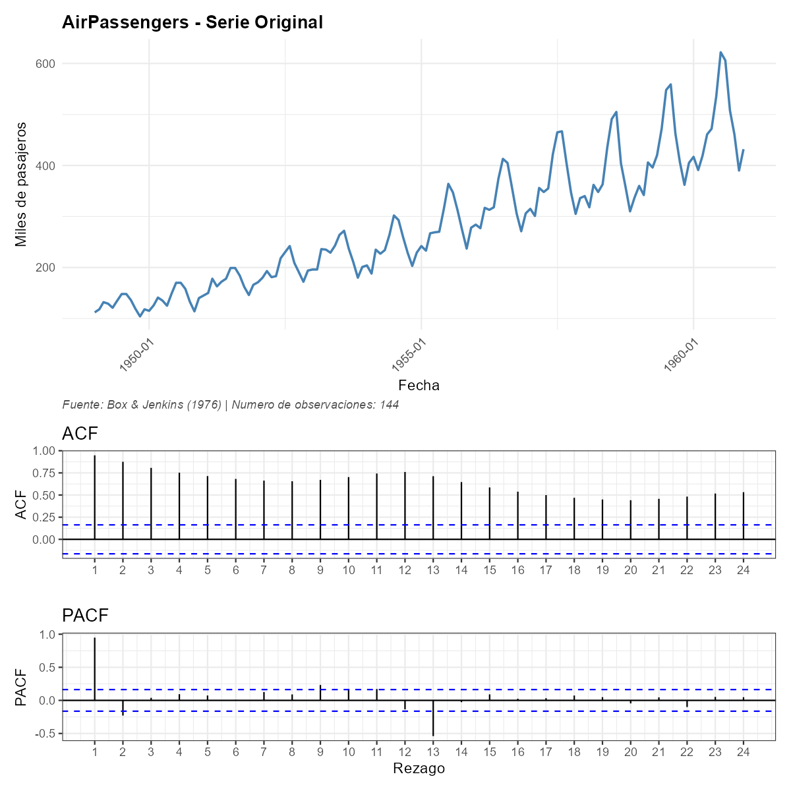{width=85%}

La serie oscila alrededor de un nivel de unos tres descubrimientos por año, sin tendencia sostenida ni patrón estacional. El supuesto de la media simple es justamente ese: un nivel constante al que se suma ruido.

```{r}
#| label: ej01-rh-serie
#| echo: false
#| results: asis
prueba_rh(ej$acf_serie, ej$N, "la serie",
  "la dependencia es débil y de corto alcance: solo los primeros rezagos superan la banda y su magnitud es moderada. No aparece el decaimiento lento que produciría una tendencia ni picos periódicos que indiquen estacionalidad.")
prueba_lb(ej$lb_serie, ej$N, 0, "la serie",
  "tomadas en conjunto, las autocorrelaciones hasta el rezago 24 no son distinguibles de cero al 5%, aunque por muy poco. La serie es compatible con un nivel constante más ruido, que es el supuesto de la media simple.")
```

### Partición y ajuste

Con $T = `r ej$N`$, el tramo de validación son las últimas $h = `r ej$h`$ observaciones y el ajuste usa las primeras `r ej$n_train`. La media simple no tiene constantes que elegir, así que no requiere `optimizar()`. Su pronóstico es la media de todo el tramo de estimación, $\bar Y_T = `r num(ej$parametros$estado_final)`$ descubrimientos por año.

### Medidas de precisión

```{r}
#| label: ej01-medidas
round(rbind(metodo_estimacion    = ej$medidas_in,
            metodo_validacion    = ej$medidas_out,
            referente_validacion = ej$medidas_referente_out), 4)
```

En el tramo de validación, la media simple obtiene un MAD de `r num(ej$medidas_out[["MAD"]])` frente a `r num(ej$medidas_referente_out[["MAD"]])` del ingenuo, es decir, un error `r num(100 * (1 - ej$medidas_out[["MAD"]] / ej$medidas_referente_out[["MAD"]]), 1)`% menor. El MASE es `r num(ej$medidas_out[["MASE"]])`. El MAPE es infinito porque la serie tiene años con cero descubrimientos, en los que el error porcentual no está definido.

### Validación de errores

{width=95%}

```{r}
#| label: ej01-errores
#| echo: false
#| results: asis
e <- ej$errores
prueba_rh(e$acf, e$n_errores, "los errores",
  "quedan autocorrelaciones positivas en los primeros rezagos: cuando un año tiene muchos descubrimientos, el siguiente tiende a tenerlos también, y la media de todo el pasado no sigue esas rachas.")
prueba_t(e$prueba_t_media, e$n_errores,
  "los errores no están sesgados: en promedio, la media simple no sobreestima ni subestima el número de descubrimientos.")
prueba_lb(e$ljung_box, e$n_errores, 0, "los errores",
  "en conjunto, los errores no muestran autocorrelación significativa; la dependencia de corto plazo que se ve en los primeros rezagos no alcanza para rechazar la independencia global.")
prueba_jb(e$jarque_bera,
  "los errores no son normales: tienen asimetría positiva y colas pesadas, como corresponde a un conteo con años excepcionales de muchos descubrimientos.")
prueba_dw(e$durbin_watson,
  "hay autocorrelación positiva de primer orden, coherente con el primer rezago fuera de la banda: el método deja sin capturar la persistencia de un año al siguiente.")
```

### Pronóstico

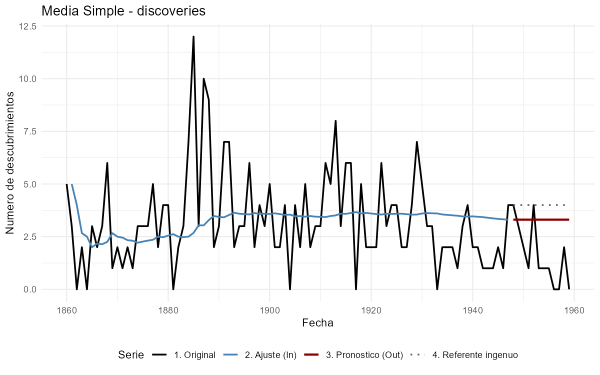{width=85%}

### Conclusión

Se ajustó la media simple recursiva sobre `r ej$n_train` años de la serie `discoveries`, con pronóstico constante de `r num(ej$parametros$estado_final)` descubrimientos por año. En el tramo de validación ($h = `r ej$h`$) su MAD fue `r num(ej$medidas_out[["MAD"]])`, menor que el `r num(ej$medidas_referente_out[["MAD"]])` del ingenuo, con MASE de `r num(ej$medidas_out[["MASE"]])`. Los errores tienen media cero ($t = `r num(e$prueba_t_media$estadistico)`$) y no rechazan la independencia global con Ljung-Box ($Q = `r num(e$ljung_box$estadistico)`$, valor p `r vp(e$ljung_box$valor_p)`), pero Durbin-Watson ($d = `r num(e$durbin_watson$estadistico)`$) revela persistencia de primer orden y Jarque-Bera ($JB = `r num(e$jarque_bera$estadistico)`$) rechaza la normalidad.

### Recomendación

Este pronóstico sirve a un historiador de la ciencia o a un editor que necesite una cifra de referencia sobre cuántos descubrimientos esperar por año. Como el pronóstico es constante, su calidad no se deteriora con el horizonte, y es razonable usarlo al menos hasta los `r ej$h` años validados. Su límite es que ignora las rachas de años más o menos productivos: el error absoluto medio de `r num(ej$medidas_out[["MAD"]])` equivale al `r num(100 * ej$medidas_out[["MAD"]] / ej$parametros$estado_final, 1)`% del nivel pronosticado, una incertidumbre relativa alta para decisiones año a año.

---

## 2. Media Móvil

```{r}
#| label: ej02-llamada
#| eval: false
ejecutar_protocolo("discoveries", datasets::discoveries,
                   "The World Almanac and Book of Facts, 1975 Edition, pages 315-318",
                   "Numero de descubrimientos", "ajustar_mm", "Media Movil",
                   p_params = 1, prefijo = "02", param_rejilla = 2:12)
```

### Descripción de la serie

```{r}
#| label: ej02-descripcion
ej <- resultados$ej02
c(N = ej$N, frecuencia = ej$frecuencia)
c(inicio = ej$fecha_ini, fin = ej$fecha_fin)
```

Se usa de nuevo la serie `discoveries`. Fuente: `r ej$fuente`. Unidad: `r tolower(ej$unidad)`. Frecuencia anual, de `r rango(ej)`, con $N = `r ej$N`$ observaciones.

### Patrón de la serie

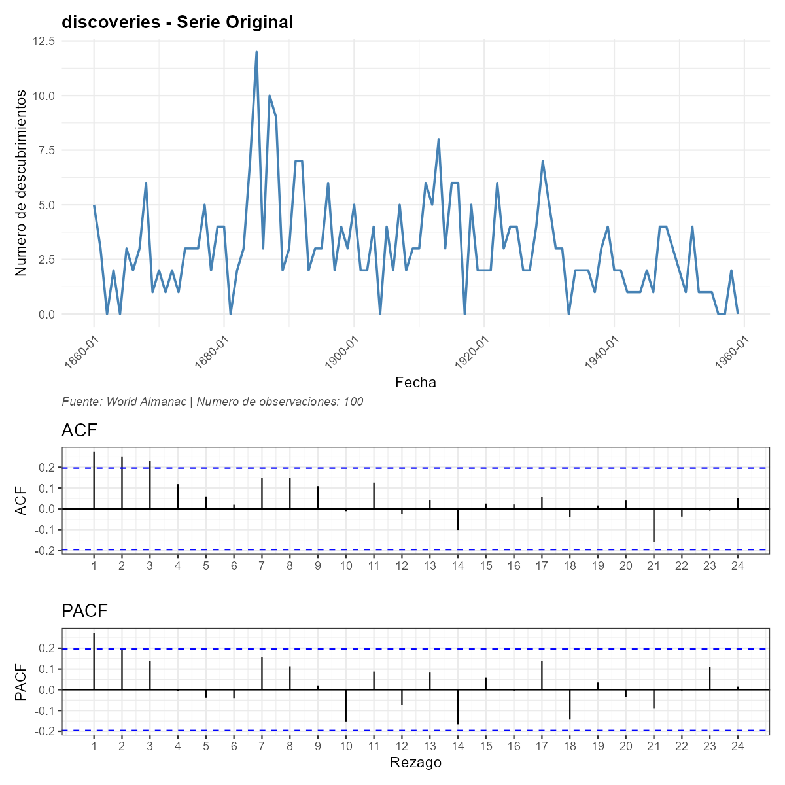{width=85%}

```{r}
#| label: ej02-rh-serie
#| echo: false
#| results: asis
prueba_rh(ej$acf_serie, ej$N, "la serie",
  "las autocorrelaciones significativas de los primeros rezagos indican que el nivel no es exactamente constante: se mueve lentamente, con rachas de años más y menos productivos. Ese es el supuesto de la media móvil, que promedia solo los años recientes para seguir un nivel que cambia localmente.")
prueba_lb(ej$lb_serie, ej$N, 0, "la serie",
  "la dependencia global es débil y no hay tendencia ni estacionalidad, así que un método de nivel es apropiado; la dependencia local de los primeros rezagos favorece un promedio de ventana corta sobre la media de todo el pasado.")
```

### Partición y ajuste

El tramo de validación son las últimas $h = `r ej$h`$ observaciones y el ajuste usa las primeras `r ej$n_train`. La ventana se eligió con `optimizar()` minimizando el MSE de un paso en el tramo de estimación sobre la rejilla $k = 2, \ldots, 12$.

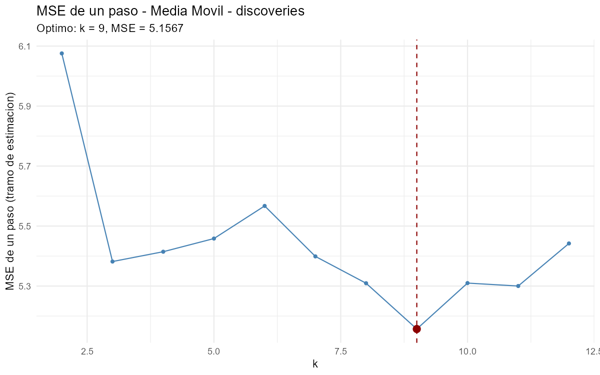{width=80%}

El óptimo es $k = `r ej$optimizacion$optimo$k`$, con MSE de `r num(ej$optimizacion$optimo$mse)`. Está en el interior de la rejilla, de modo que la ventana no quedó forzada por los límites de búsqueda.

### Medidas de precisión

```{r}
#| label: ej02-medidas
round(rbind(metodo_estimacion    = ej$medidas_in,
            metodo_validacion    = ej$medidas_out,
            referente_validacion = ej$medidas_referente_out), 4)
```

En validación, la media móvil obtiene un MAD de `r num(ej$medidas_out[["MAD"]])` frente a `r num(ej$medidas_referente_out[["MAD"]])` del ingenuo, un error `r num(100 * (1 - ej$medidas_out[["MAD"]] / ej$medidas_referente_out[["MAD"]]), 1)`% menor, con MASE de `r num(ej$medidas_out[["MASE"]])`. También mejora a la media simple del ejemplo 1, cuyo MAD fue `r num(resultados$ej01$medidas_out[["MAD"]])`. El MAPE es infinito por los años con cero descubrimientos.

### Validación de errores

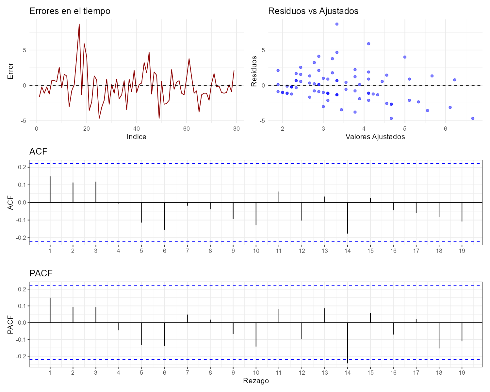{width=95%}

```{r}
#| label: ej02-errores
#| echo: false
#| results: asis
e <- ej$errores
prueba_rh(e$acf, e$n_errores, "los errores",
  "a diferencia de la media simple, ninguna autocorrelación de los errores es significativa: al promediar los años recientes, la media móvil absorbe la persistencia de corto plazo.")
prueba_t(e$prueba_t_media, e$n_errores,
  "los errores no están sesgados.")
prueba_lb(e$ljung_box, e$n_errores, 1, "los errores",
  "los errores se comportan como ruido blanco: el método captura toda la estructura de dependencia de la serie.")
prueba_jb(e$jarque_bera,
  "los errores no son normales, por la asimetría positiva propia de un conteo con años excepcionales.")
prueba_dw(e$durbin_watson,
  "no queda autocorrelación de primer orden en los errores.")
```

### Pronóstico

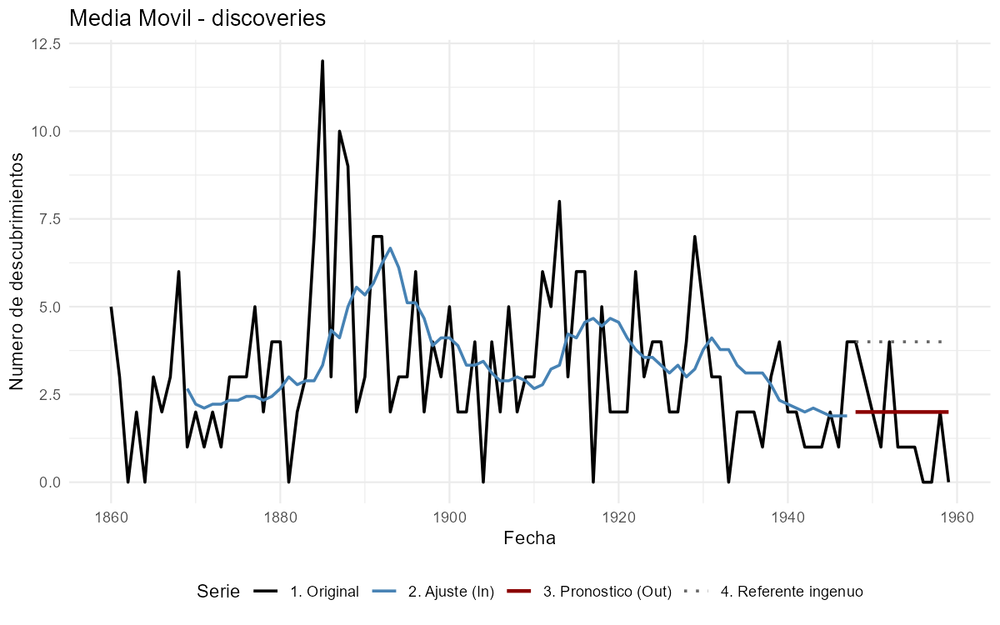{width=85%}

### Conclusión

Se ajustó una media móvil de orden $k = `r ej$optimizacion$optimo$k`$, elegido por `optimizar()`, con pronóstico constante de `r num(ej$parametros$estado_final)` descubrimientos por año. En validación ($h = `r ej$h`$) su MAD fue `r num(ej$medidas_out[["MAD"]])`, frente a `r num(ej$medidas_referente_out[["MAD"]])` del ingenuo, con MASE de `r num(ej$medidas_out[["MASE"]])`. Los errores cumplen media cero ($t = `r num(e$prueba_t_media$estadistico)`$), independencia según Ljung-Box ($Q = `r num(e$ljung_box$estadistico)`$, valor p `r vp(e$ljung_box$valor_p)`) y Durbin-Watson ($d = `r num(e$durbin_watson$estadistico)`$), pero no normalidad ($JB = `r num(e$jarque_bera$estadistico)`$).

### Recomendación

Este pronóstico sirve para estimar la tasa de descubrimientos del período reciente, por ejemplo para un historiador que compare décadas. Es razonable hasta los `r ej$h` años validados, porque el nivel cambia despacio. Su límite es el rezago de reacción: al promediar `r ej$optimizacion$optimo$k` años, tarda varios años en reflejar un cambio de nivel, y en validación su mayor error absoluto fue de `r num(max(err_h(ej)), 1)` descubrimientos en un solo año. Además, como los errores no son normales, los intervalos de pronóstico basados en la normal no serían confiables.

---

## 3. Suavizamiento Exponencial Simple

```{r}
#| label: ej03-llamada
#| eval: false
ejecutar_protocolo("Nile", datasets::Nile,
                   "Durbin, J. and Koopman, S. J. (2001) Time Series Analysis by State Space Methods. Oxford University Press",
                   "Flujo anual (10^8 m^3)", "ajustar_ses", "Suavizamiento Exponencial Simple",
                   p_params = 1, prefijo = "03", param_rejilla = seq(0.02, 0.98, by = 0.02))
```

### Descripción de la serie

```{r}
#| label: ej03-descripcion
ej <- resultados$ej03
c(N = ej$N, frecuencia = ej$frecuencia)
c(inicio = ej$fecha_ini, fin = ej$fecha_fin)
```

La serie `Nile` mide el caudal anual del río Nilo en Asuán. Fuente: `r ej$fuente`. Unidad: flujo anual en $10^8\,m^3$. Frecuencia anual, de `r rango(ej)`, con $N = `r ej$N`$ observaciones.

### Patrón de la serie

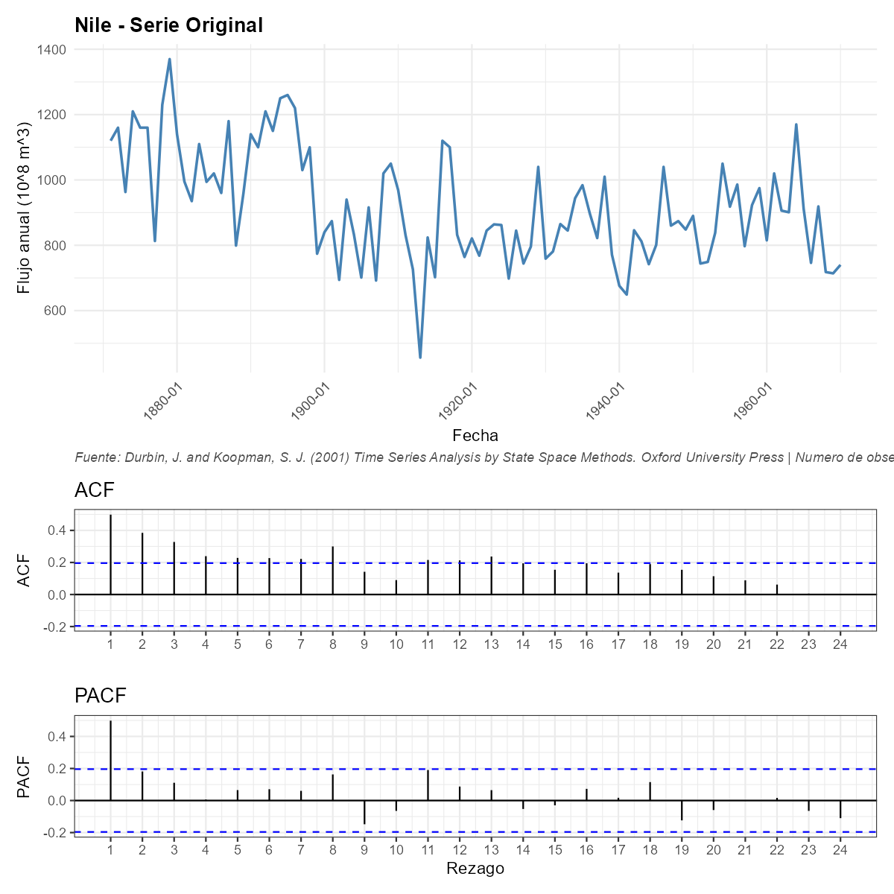{width=85%}

La serie no tiene una tendencia sostenida, pero su nivel cambia: alrededor de 1898 el caudal cae a un nivel más bajo y se mantiene allí. Un nivel que se desplaza en el tiempo, sin pendiente, es el supuesto del suavizamiento exponencial simple, que actualiza el nivel con cada observación nueva.

```{r}
#| label: ej03-rh-serie
#| echo: false
#| results: asis
prueba_rh(ej$acf_serie, ej$N, "la serie",
  "las autocorrelaciones son positivas y significativas en muchos rezagos, algo que se espera cuando el nivel cambia: los años anteriores al quiebre se parecen entre sí, y lo mismo ocurre después. Un nivel fijo no describiría bien la serie.")
prueba_lb(ej$lb_serie, ej$N, 0, "la serie",
  "la serie tiene una dependencia temporal fuerte, así que un método que se apoye en el pasado reciente, como el SES, tiene información útil que aprovechar.")
```

### Partición y ajuste

El tramo de validación son las últimas $h = `r ej$h`$ observaciones y el ajuste usa las primeras `r ej$n_train`. La constante se eligió con `optimizar()` sobre la rejilla $\alpha = 0.02, 0.04, \ldots, 0.98$.

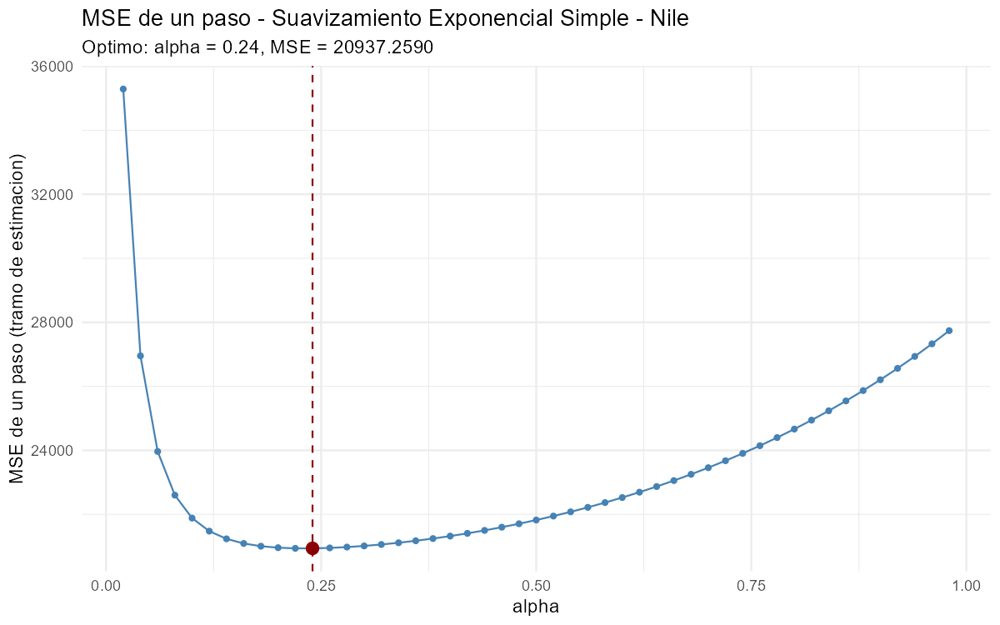{width=80%}

El óptimo es $\alpha = `r ej$optimizacion$optimo$alpha`$, con MSE de `r num(ej$optimizacion$optimo$mse, 1)`. Está en el interior de la rejilla: el nivel se actualiza con un peso moderado a la última observación, lo que confirma que la serie tiene un nivel que cambia, pero no tan rápido como para que convenga el ingenuo ($\alpha$ cercano a 1).

### Medidas de precisión

```{r}
#| label: ej03-medidas
round(rbind(metodo_estimacion    = ej$medidas_in,
            metodo_validacion    = ej$medidas_out,
            referente_validacion = ej$medidas_referente_out), 4)
```

En validación, el SES obtiene un MAD de `r num(ej$medidas_out[["MAD"]], 2)` frente a `r num(ej$medidas_referente_out[["MAD"]], 2)` del ingenuo, un error `r num(100 * (1 - ej$medidas_out[["MAD"]] / ej$medidas_referente_out[["MAD"]]), 1)`% menor. El MAPE es `r num(ej$medidas_out[["MAPE"]], 2)`% y el MASE `r num(ej$medidas_out[["MASE"]])`.

### Validación de errores

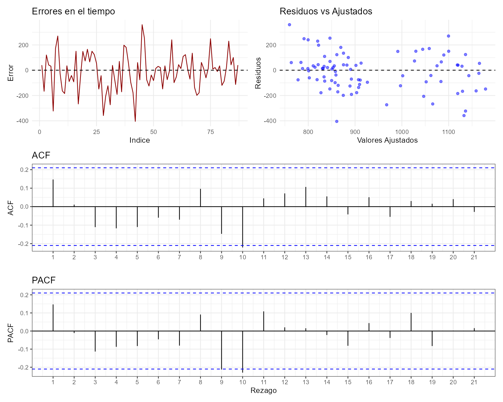{width=95%}

```{r}
#| label: ej03-errores
#| echo: false
#| results: asis
e <- ej$errores
prueba_rh(e$acf, e$n_errores, "los errores",
  "solo un rezago aislado sale de la banda, lo esperable por azar al examinar tantos rezagos al 5%. No hay un patrón de autocorrelación en los errores.")
prueba_t(e$prueba_t_media, e$n_errores,
  "los errores no están sesgados: el SES no sobreestima ni subestima el caudal de forma sistemática.")
prueba_lb(e$ljung_box, e$n_errores, 1, "los errores",
  "los errores se comportan como ruido blanco: el SES captura la dependencia que tenía la serie.")
prueba_jb(e$jarque_bera,
  "los errores son compatibles con una distribución normal.")
prueba_dw(e$durbin_watson,
  "no queda autocorrelación de primer orden en los errores.")
```

### Pronóstico

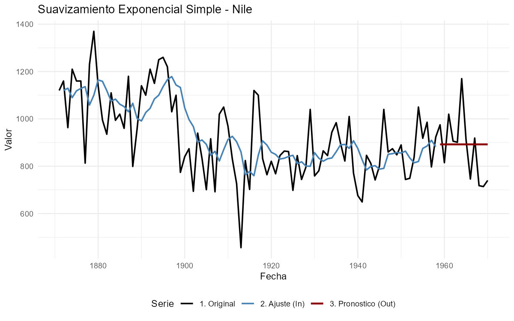{width=85%}

### Conclusión

Se ajustó el suavizamiento exponencial simple con $\alpha = `r ej$optimizacion$optimo$alpha`$, elegido por `optimizar()`, con pronóstico constante de `r num(ej$parametros$estado_final, 1)` $\times 10^8\,m^3$. En validación ($h = `r ej$h`$) su MAD fue `r num(ej$medidas_out[["MAD"]], 2)`, frente a `r num(ej$medidas_referente_out[["MAD"]], 2)` del ingenuo, con MAPE de `r num(ej$medidas_out[["MAPE"]], 2)`% y MASE de `r num(ej$medidas_out[["MASE"]])`. Los errores cumplen todos los supuestos: media cero ($t = `r num(e$prueba_t_media$estadistico)`$), independencia según Ljung-Box ($Q = `r num(e$ljung_box$estadistico)`$, valor p `r vp(e$ljung_box$valor_p)`) y Durbin-Watson ($d = `r num(e$durbin_watson$estadistico)`$), y normalidad ($JB = `r num(e$jarque_bera$estadistico)`$, valor p `r vp(e$jarque_bera$valor_p)`).

### Recomendación

Este pronóstico sirve a quienes planean el uso del agua del Nilo, como autoridades de riego o de generación hidroeléctrica, que necesitan una estimación del caudal esperado. Es razonable hasta los `r ej$h` años validados, porque el pronóstico es un nivel y el caudal no tiene tendencia. Su límite es que no anticipa cambios de nivel como el de 1898 ni los años extremos: la ventaja sobre el ingenuo es de apenas `r num(100 * (1 - ej$medidas_out[["MAD"]] / ej$medidas_referente_out[["MAD"]]), 1)`%, y en validación el mayor error absoluto fue de `r num(max(err_h(ej)), 1)` $\times 10^8\,m^3$ en un solo año.

---

## 4. Doble Media Móvil

```{r}
#| label: ej04-llamada
#| eval: false
ejecutar_protocolo("WWWusage", datasets::WWWusage,
                   "Durbin, J. and Koopman, S. J. (2001) Time Series Analysis by State Space Methods. Oxford University Press",
                   "Usuarios conectados por minuto", "ajustar_dmm", "Doble Media Movil",
                   p_params = 1, prefijo = "04", param_rejilla = 2:12)
```

### Descripción de la serie

```{r}
#| label: ej04-descripcion
ej <- resultados$ej04
c(N = ej$N, frecuencia = ej$frecuencia)
c(inicio = ej$fecha_ini, fin = ej$fecha_fin)
```

La serie `WWWusage` registra el número de usuarios conectados a internet a través de un servidor, medido cada minuto. Fuente: `r ej$fuente`. Unidad: `r tolower(ej$unidad)`. R la almacena como una serie de frecuencia `r ej$frecuencia` que empieza en el período 1, así que `leer_serie()` le asigna fechas desde el año 1; esas fechas son solo un índice de minutos, del 1 al `r ej$N`, con $N = `r ej$N`$ observaciones.

### Patrón de la serie

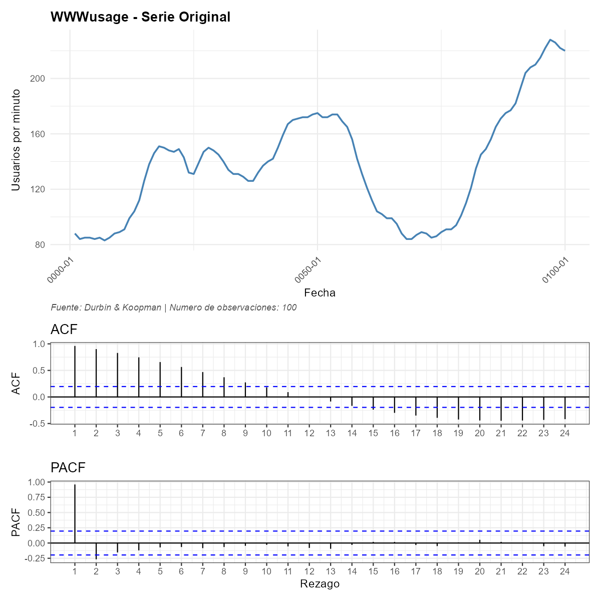{width=85%}

La serie sube y baja en tramos largos: tiene tendencias locales que cambian de dirección, sin una tendencia global única. Ese es el supuesto de la doble media móvil, que estima un nivel y una pendiente locales y los actualiza a medida que avanza.

```{r}
#| label: ej04-rh-serie
#| echo: false
#| results: asis
prueba_rh(ej$acf_serie, ej$N, "la serie",
  "la ACF es positiva y decae despacio en los primeros rezagos y luego se vuelve negativa en los rezagos altos. Ese patrón aparece cuando la serie pasa tramos largos por encima y por debajo de su media, es decir, cuando tiene tendencias locales que se revierten.",
  lags = c(1, 2, 5, 9, 15, 20))
prueba_lb(ej$lb_serie, ej$N, 0, "la serie",
  "la dependencia temporal es muy fuerte: cada minuto se parece mucho a los anteriores, así que la dirección reciente de la serie es informativa para pronosticar.")
```

### Partición y ajuste

El tramo de validación son las últimas $h = `r ej$h`$ observaciones y el ajuste usa las primeras `r ej$n_train`. La ventana se eligió con `optimizar()` sobre la rejilla $k = 2, \ldots, 12$.

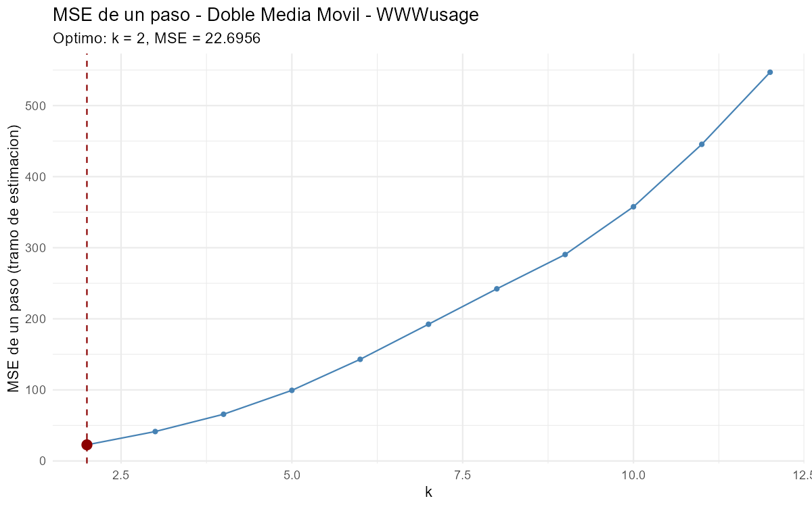{width=80%}

El óptimo es $k = `r ej$optimizacion$optimo$k`$, con MSE de `r num(ej$optimizacion$optimo$mse)`, y cae en el borde inferior de la rejilla. La curva sube de forma monótona hasta un MSE de `r num(max(ej$optimizacion$rejilla$mse), 1)` con $k = 12$, es decir, el MSE baja a medida que la ventana se acorta: la pendiente de la serie cambia tan rápido que cualquier ventana más larga reacciona tarde. Con $k = 2$, la doble media móvil es lo más reactiva que puede ser y se acerca a proyectar el cambio más reciente de la serie.

### Medidas de precisión

```{r}
#| label: ej04-medidas
round(rbind(metodo_estimacion    = ej$medidas_in,
            metodo_validacion    = ej$medidas_out,
            referente_validacion = ej$medidas_referente_out), 4)
```

En validación, la doble media móvil obtiene un MAD de `r num(ej$medidas_out[["MAD"]], 2)` usuarios frente a `r num(ej$medidas_referente_out[["MAD"]], 2)` del ingenuo, es decir, un error `r num(100 * (1 - ej$medidas_out[["MAD"]] / ej$medidas_referente_out[["MAD"]]), 1)`% menor, con MAPE de `r num(ej$medidas_out[["MAPE"]], 2)`%. El MASE es `r num(ej$medidas_out[["MASE"]])`, mayor que 1, pero eso no indica que pierda contra el referente: el MASE se escala con el error del ingenuo de un paso en el tramo de estimación (`r num(ej$mad_referente_in, 2)`), mientras que en validación se pronostica hasta `r ej$h` minutos adelante. En ese tramo la serie tiene una pendiente marcada que el ingenuo, al congelar el último valor, no sigue.

### Validación de errores

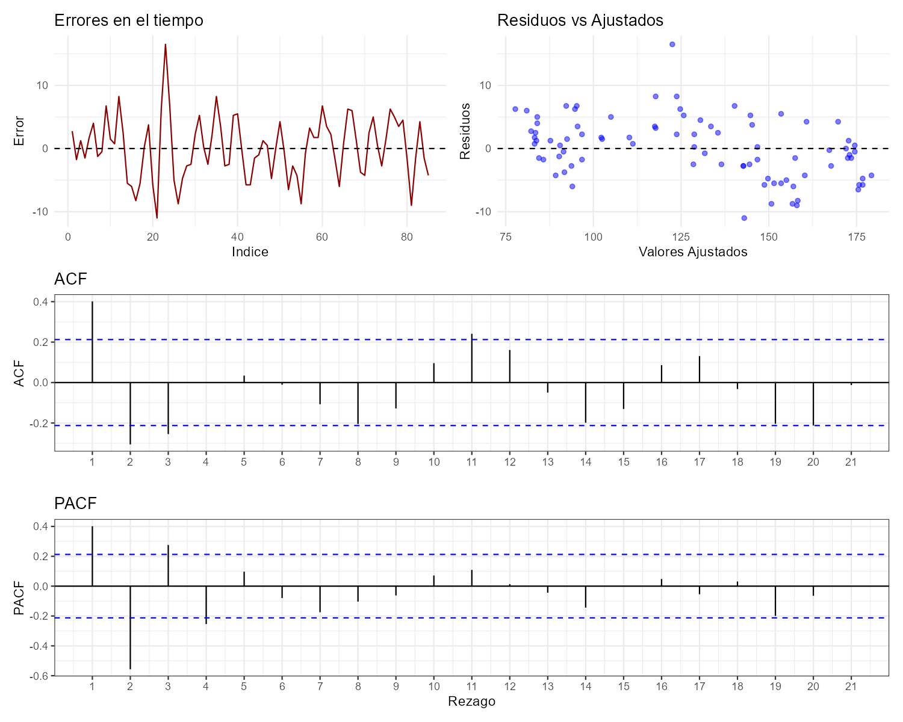{width=95%}

```{r}
#| label: ej04-errores
#| echo: false
#| results: asis
e <- ej$errores
prueba_rh(e$acf, e$n_errores, "los errores",
  "los primeros rezagos siguen fuera de la banda: los errores de minutos consecutivos se parecen, porque la pendiente estimada con dos períodos es ruidosa y el método sobrerreacciona en los cambios de dirección.")
prueba_t(e$prueba_t_media, e$n_errores,
  "los errores no están sesgados.")
prueba_lb(e$ljung_box, e$n_errores, 1, "los errores",
  "queda autocorrelación que el método no captura: la dinámica del tráfico tiene más estructura que un nivel y una pendiente locales.")
prueba_jb(e$jarque_bera,
  "los errores son compatibles con una distribución normal.")
prueba_dw(e$durbin_watson,
  "hay autocorrelación positiva de primer orden, coherente con el primer rezago fuera de la banda.")
```

### Pronóstico

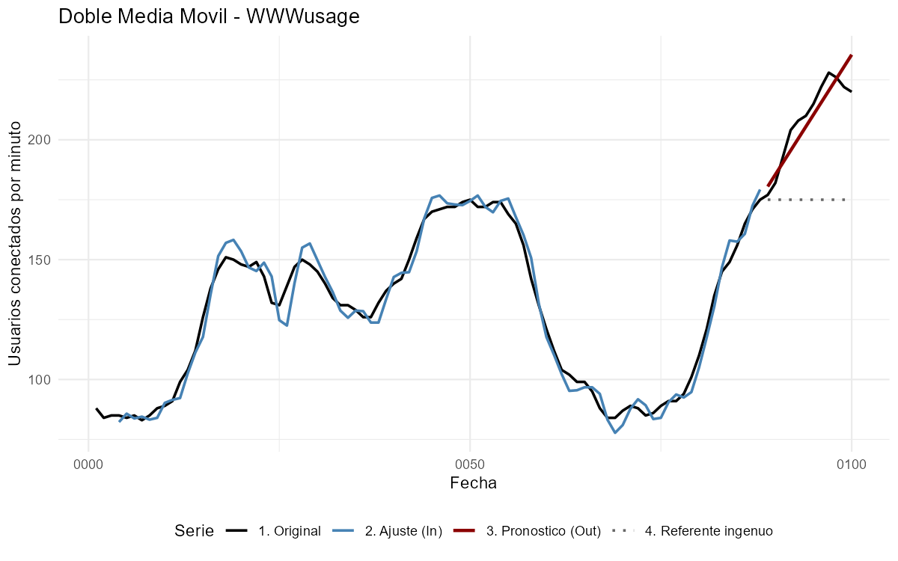{width=85%}

### Conclusión

Se ajustó una doble media móvil de orden $k = `r ej$optimizacion$optimo$k`$, elegido por `optimizar()` en el borde inferior de la rejilla. En validación ($h = `r ej$h`$) su MAD fue `r num(ej$medidas_out[["MAD"]], 2)` usuarios, muy por debajo de los `r num(ej$medidas_referente_out[["MAD"]], 2)` del ingenuo, con MAPE de `r num(ej$medidas_out[["MAPE"]], 2)`%. Los errores tienen media cero ($t = `r num(e$prueba_t_media$estadistico)`$) y son normales ($JB = `r num(e$jarque_bera$estadistico)`$), pero conservan autocorrelación según Ljung-Box ($Q = `r num(e$ljung_box$estadistico)`$, valor p `r vp(e$ljung_box$valor_p)`) y Durbin-Watson ($d = `r num(e$durbin_watson$estadistico)`$).

### Recomendación

Este pronóstico sirve a un administrador de red que deba asignar capacidad de conexión en los minutos siguientes. Es razonable solo a corto plazo, porque el método prolonga en línea recta la pendiente estimada con los últimos minutos: en validación, el error absoluto fue de `r num(err_h(ej)[1], 1)` usuarios en el primer minuto pronosticado y llegó a `r num(max(err_h(ej)), 1)` en el peor minuto del horizonte. Su límite es que no anticipa los cambios de dirección del tráfico, y la autocorrelación que queda en los errores indica que un modelo con más memoria podría mejorarlo.

---

## 5. Tendencia Lineal

```{r}
#| label: ej05-llamada
#| eval: false
ejecutar_protocolo("austres", datasets::austres,
                   "P. J. Brockwell and R. A. Davis (1996) Introduction to Time Series and Forecasting. Springer",
                   "Miles de residentes", "ajustar_tendencia", "Tendencia Lineal",
                   p_params = 2, prefijo = "05", es_tendencia = TRUE, tipo_tend = "lineal",
                   estacional = FALSE, dL = 1.598, dU = 1.652)
```

### Descripción de la serie

```{r}
#| label: ej05-descripcion
ej <- resultados$ej05
c(N = ej$N, frecuencia = ej$frecuencia)
c(inicio = ej$fecha_ini, fin = ej$fecha_fin)
```

La serie `austres` registra el número de residentes de Australia, medido trimestralmente. Fuente: `r ej$fuente`. Unidad: `r tolower(ej$unidad)`. Frecuencia trimestral, de `r rango(ej)`, con $N = `r ej$N`$ observaciones. Aunque es trimestral, la población no tiene un patrón estacional, así que el referente es el ingenuo simple y no el estacional.

### Patrón de la serie

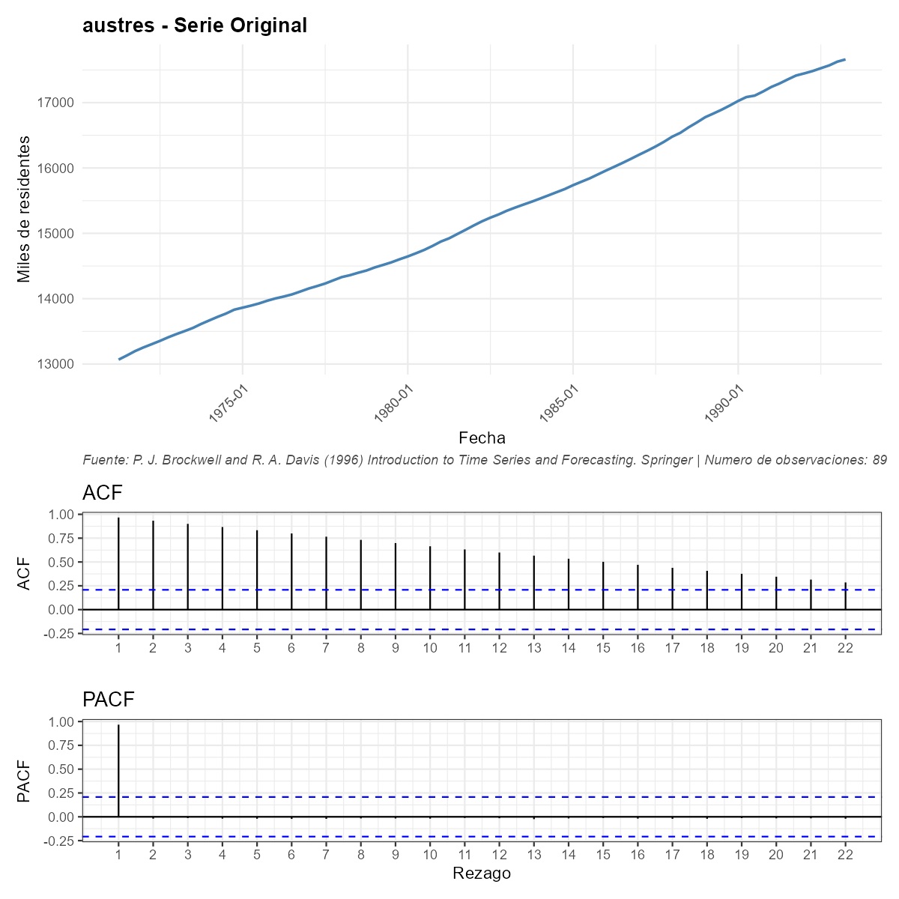{width=85%}

La población crece de forma casi recta durante todo el período, sin curvatura visible ni estacionalidad. Ese es el supuesto de la tendencia lineal: un crecimiento de magnitud constante por período.

```{r}
#| label: ej05-rh-serie
#| echo: false
#| results: asis
prueba_rh(ej$acf_serie, ej$N, "la serie",
  "todas las autocorrelaciones examinadas son positivas, significativas y decaen muy despacio. Ese es el correlograma típico de una serie dominada por una tendencia: cada valor se parece a los anteriores porque todos están sobre la misma recta.",
  lags = c(1, 4, 8, 12, 16, 22))
prueba_lb(ej$lb_serie, ej$N, 0, "la serie",
  "la dependencia temporal es enorme, como corresponde a una tendencia determinística.")
```

### Partición y ajuste

El tramo de validación son las últimas $h = `r ej$h`$ observaciones y el ajuste usa las primeras `r ej$n_train`. La tendencia $T_t = \beta_0 + \beta_1 t$ se estima por mínimos cuadrados con las ecuaciones normales; no tiene constantes de suavizamiento, así que no requiere `optimizar()`.

```{r}
#| label: ej05-coeficientes
round(ej$parametros$tabla, 4)
c(R2 = ej$parametros$R2, sigma2 = ej$parametros$sigma2, DW = ej$parametros$DW,
  rezagos_HAC = ej$parametros$rezagos_HAC)
```

La recta ajustada explica el `r num(100 * ej$parametros$R2, 2)`% de la variación. Los residuos tienen una autocorrelación positiva muy fuerte (se muestra en la validación), y en ese caso los errores estándar ordinarios subestiman la incertidumbre: suponen que cada residuo aporta información independiente, cuando en realidad residuos vecinos repiten casi la misma información. Aquí el error estándar robusto de la pendiente es `r num(ej$parametros$tabla["beta_1", "SE_Robusto"] / ej$parametros$tabla["beta_1", "SE_OLS"], 2)` veces el ordinario. Por eso los valores p ordinarios no son interpretables y las pruebas sobre los coeficientes se hacen con los errores robustos.

```{r}
#| label: ej05-pruebas-coef
#| echo: false
#| results: asis
prueba_coef(ej, "beta_0", "\\beta_0",
  "el intercepto es significativo: la población al inicio del tramo es claramente distinta de cero, como era de esperarse.")
prueba_coef(ej, "beta_1", "\\beta_1",
  paste0("la pendiente es significativa: la población crece en promedio ", num(ej$parametros$tabla["beta_1", "Estimacion"], 2), " miles de residentes por trimestre."))
```

### Medidas de precisión

```{r}
#| label: ej05-medidas
round(rbind(metodo_estimacion    = ej$medidas_in,
            metodo_validacion    = ej$medidas_out,
            referente_validacion = ej$medidas_referente_out), 4)
```

En validación, la tendencia lineal obtiene un MAD de `r num(ej$medidas_out[["MAD"]], 2)` miles de residentes frente a `r num(ej$medidas_referente_out[["MAD"]], 2)` del ingenuo, un error `r num(100 * (1 - ej$medidas_out[["MAD"]] / ej$medidas_referente_out[["MAD"]]), 1)`% menor, con MAPE de `r num(ej$medidas_out[["MAPE"]], 2)`%. El MASE de `r num(ej$medidas_out[["MASE"]], 2)` es mayor que 1 porque se escala con el cambio de un trimestre a otro (`r num(ej$mad_referente_in, 2)` miles), mientras que en validación se pronostica hasta `r ej$h` trimestres adelante; frente al ingenuo evaluado en el mismo tramo, la recta es claramente mejor.

### Validación de errores

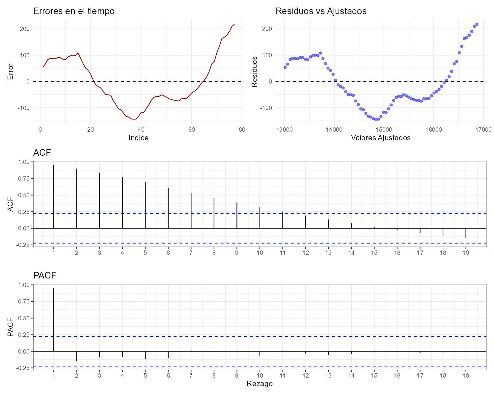{width=95%}

En este ejemplo los errores de un paso son los residuos de la regresión, así que las pruebas sirven a la vez para validar el método y para revisar los supuestos del modelo de regresión. Para la varianza constante se usa el panel de residuos contra valores ajustados. Los residuos no se dispersan al azar alrededor de cero: forman una onda suave, positivos en los valores ajustados bajos, negativos en los intermedios y de nuevo positivos y crecientes en los más altos. No aparece un embudo que indique varianza creciente, pero el patrón sistemático muestra que la población no creció exactamente en línea recta, y que al final del tramo de estimación la serie ya iba por encima de la recta. La ACF de los residuos decae despacio y la PACF solo tiene el primer rezago significativo, la forma típica de residuos con dependencia de tipo autorregresivo de primer orden.

```{r}
#| label: ej05-errores
#| echo: false
#| results: asis
e <- ej$errores
prueba_rh(e$acf, e$n_errores, "los residuos",
  "los residuos tienen autocorrelación positiva fuerte en muchos rezagos: la población no crece exactamente en línea recta, sino con ondas largas alrededor de la recta que la tendencia no captura.")
prueba_t(e$prueba_t_media, e$n_errores,
  "la media de los residuos es cero, lo cual está garantizado por construcción en una regresión con intercepto.")
prueba_lb(e$ljung_box, e$n_errores, 2, "los residuos",
  "los residuos no son independientes; queda estructura sin capturar.")
prueba_jb(e$jarque_bera,
  "los residuos son compatibles con una distribución normal.")
prueba_dw_tabla(e$durbin_watson, 1, 75,
  paste0("hay autocorrelación positiva de primer orden muy fuerte, con $r_1 \\approx 1 - d/2 = ", num(e$durbin_watson$r1_aprox), "$. La tabla no tiene la fila $T = 77$ y se usa la inmediatamente inferior; con un $d$ tan pequeño la decisión no depende de esa elección."))
```

### Pronóstico

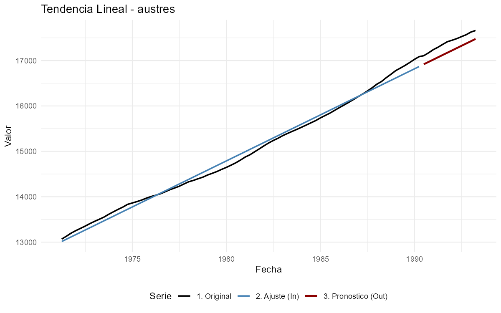{width=85%}

### Conclusión

Se ajustó por mínimos cuadrados la recta $\hat T_t = `r num(ej$parametros$tabla["beta_0", "Estimacion"], 2)` + `r num(ej$parametros$tabla["beta_1", "Estimacion"], 3)`\,t$, con ambos coeficientes significativos usando errores robustos y $R^2 = `r num(ej$parametros$R2, 4)`$. En validación ($h = `r ej$h`$) su MAD fue `r num(ej$medidas_out[["MAD"]], 2)` miles de residentes, frente a `r num(ej$medidas_referente_out[["MAD"]], 2)` del ingenuo, con MAPE de `r num(ej$medidas_out[["MAPE"]], 2)`%. Los residuos cumplen media cero y normalidad ($JB = `r num(e$jarque_bera$estadistico)`$), pero tienen autocorrelación fuerte según Ljung-Box ($Q = `r num(e$ljung_box$estadistico, 2)`$) y Durbin-Watson ($d = `r num(e$durbin_watson$estadistico)`$).

### Recomendación

Este pronóstico sirve a una oficina de planeación que necesite proyecciones de población para servicios públicos. Con un MAPE de `r num(ej$medidas_out[["MAPE"]], 2)`% es razonable hasta los `r ej$h` trimestres validados, es decir, tres años. Su límite es que supone un crecimiento constante e indefinido, y la fuerte autocorrelación de los residuos hace que los errores no se compensen entre trimestres: en validación, el mayor error absoluto fue de `r num(max(err_h(ej)), 1)` miles de residentes.

---

## 6. Tendencia Cuadrática

```{r}
#| label: ej06-llamada
#| eval: false
ejecutar_protocolo("airmiles", datasets::airmiles,
                   "F.A.A. Statistical Handbook of Aviation",
                   "Millas-pasajero (millones)", "ajustar_tendencia", "Tendencia Cuadratica",
                   p_params = 3, prefijo = "06", es_tendencia = TRUE, tipo_tend = "cuadratica",
                   dL = 1.100, dU = 1.537)
```

### Descripción de la serie

```{r}
#| label: ej06-descripcion
ej <- resultados$ej06
c(N = ej$N, frecuencia = ej$frecuencia)
c(inicio = ej$fecha_ini, fin = ej$fecha_fin)
```

La serie `airmiles` registra las millas-pasajero de ingresos voladas por las aerolíneas comerciales de Estados Unidos cada año. Fuente: `r ej$fuente`. Unidad: `r tolower(ej$unidad)`. Frecuencia anual, de `r rango(ej)`, con $N = `r ej$N`$ observaciones.

### Patrón de la serie

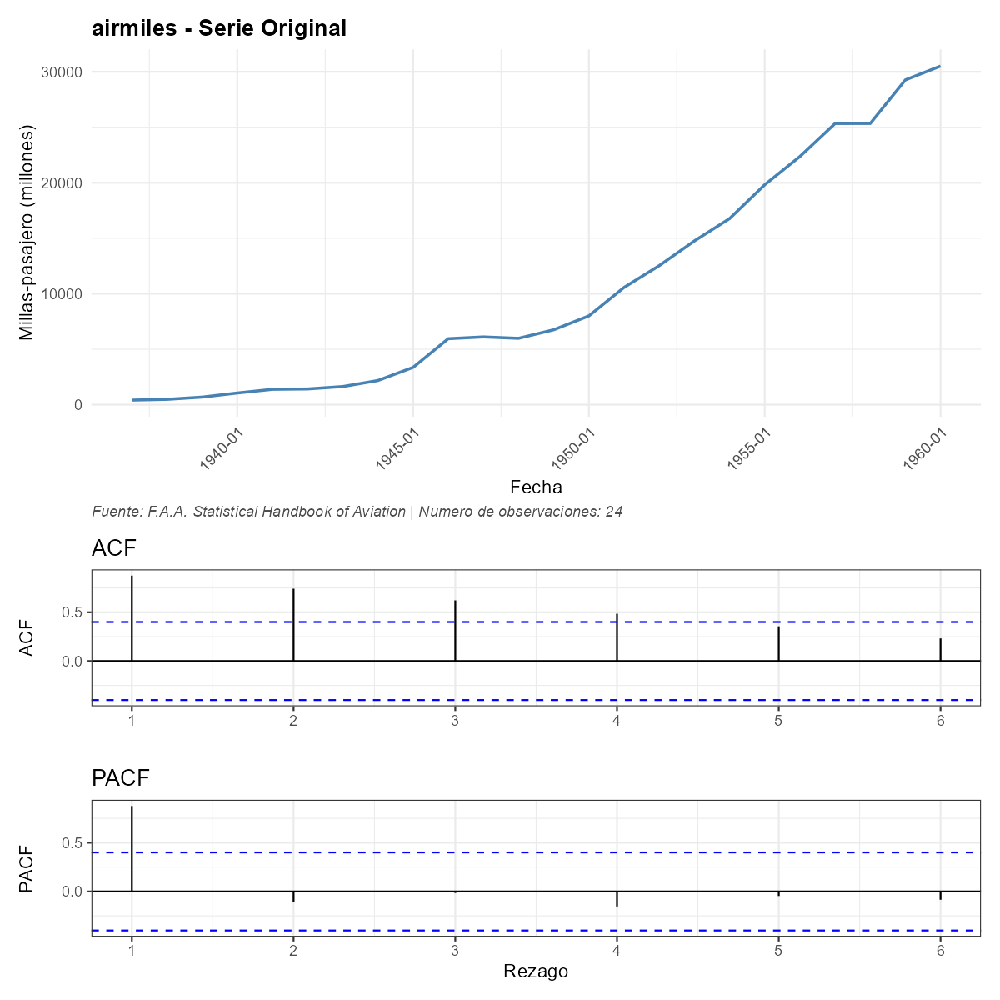{width=85%}

El tráfico aéreo no solo crece, sino que crece cada vez más rápido: la curva es convexa, con incrementos anuales que aumentan con el tiempo. Una pendiente que cambia de forma sostenida es el supuesto de la tendencia cuadrática, cuyo término $\beta_2 t^2$ modela esa aceleración.

```{r}
#| label: ej06-rh-serie
#| echo: false
#| results: asis
prueba_rh(ej$acf_serie, ej$N, "la serie",
  "las primeras autocorrelaciones son positivas, significativas y decrecen despacio, como corresponde a una serie dominada por una tendencia. Con solo 24 observaciones, el número de rezagos examinados es $m = \\lfloor 24/4 \\rfloor = 6$.")
prueba_lb(ej$lb_serie, ej$N, 0, "la serie",
  "la serie tiene una dependencia temporal fuerte, producida por su tendencia.")
```

### Partición y ajuste

Con $T = `r ej$N`$, el tramo de validación son las últimas $h = \lfloor 0.2 \times `r ej$N` \rfloor = `r ej$h`$ observaciones y el ajuste usa las primeras `r ej$n_train`. La tendencia $T_t = \beta_0 + \beta_1 t + \beta_2 t^2$ se estima con las ecuaciones normales y no requiere `optimizar()`.

```{r}
#| label: ej06-coeficientes
round(ej$parametros$tabla, 4)
c(R2 = ej$parametros$R2, sigma2 = ej$parametros$sigma2, DW = ej$parametros$DW,
  rezagos_HAC = ej$parametros$rezagos_HAC)
```

La curva ajustada explica el `r num(100 * ej$parametros$R2, 2)`% de la variación. Los residuos tienen autocorrelación positiva (se muestra en la validación), y por eso los errores estándar ordinarios no son confiables: tratan como independientes residuos que se parecen entre sí y subestiman la incertidumbre. Aquí el error estándar robusto de $\hat\beta_2$ es `r num(ej$parametros$tabla["beta_2", "SE_Robusto"] / ej$parametros$tabla["beta_2", "SE_OLS"], 2)` veces el ordinario, así que las pruebas se hacen con los robustos.

```{r}
#| label: ej06-pruebas-coef
#| echo: false
#| results: asis
prueba_coef(ej, "beta_0", "\\beta_0",
  "el intercepto es significativo al 5%.")
prueba_coef(ej, "beta_1", "\\beta_1",
  "el término lineal es significativo y negativo. No tiene una lectura propia: junto con la curvatura, ubica el mínimo de la parábola en los primeros años del período, y a partir de allí domina la aceleración.")
prueba_coef(ej, "beta_2", "\\beta_2",
  "la curvatura es positiva y muy significativa: el tráfico aéreo se acelera año tras año, que es justamente lo que justifica la tendencia cuadrática frente a una recta.")
```

### Medidas de precisión

```{r}
#| label: ej06-medidas
round(rbind(metodo_estimacion    = ej$medidas_in,
            metodo_validacion    = ej$medidas_out,
            referente_validacion = ej$medidas_referente_out), 4)
```

En validación, la tendencia cuadrática obtiene un MAD de `r num(ej$medidas_out[["MAD"]], 1)` millones de millas-pasajero frente a `r num(ej$medidas_referente_out[["MAD"]], 1)` del ingenuo, un error `r num(100 * (1 - ej$medidas_out[["MAD"]] / ej$medidas_referente_out[["MAD"]]), 1)`% menor, con MAPE de `r num(ej$medidas_out[["MAPE"]], 2)`%. El MASE de `r num(ej$medidas_out[["MASE"]])` es mayor que 1 porque se escala con el cambio de un año a otro en el tramo de estimación, cuando los valores eran mucho más pequeños; frente al ingenuo en el mismo tramo de validación, la cuadrática es muy superior, porque el ingenuo congela el último valor en una serie que sigue acelerando.

### Validación de errores

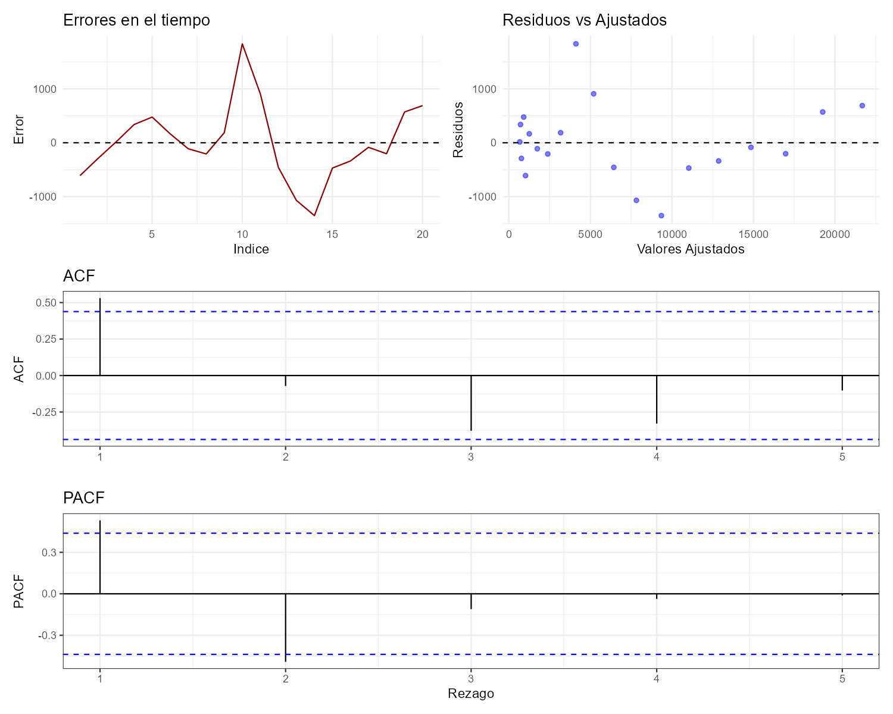{width=95%}

Los errores de un paso son los residuos de la regresión. En el panel de residuos contra valores ajustados no aparece un embudo: la dispersión no crece de forma clara con el nivel ajustado. El residuo más grande corresponde al décimo año del tramo, 1946, cuando el tráfico aéreo saltó con el fin de la Segunda Guerra Mundial, y es seguido por varios años de residuos negativos. Con solo `r ej$errores$n_errores` residuos, esta lectura de la varianza es necesariamente aproximada.

```{r}
#| label: ej06-errores
#| echo: false
#| results: asis
e <- ej$errores
prueba_rh(e$acf, e$n_errores, "los residuos",
  "el primer rezago queda fuera de la banda: residuos de años consecutivos tienden a tener el mismo signo, lo que indica que la parábola no sigue del todo la forma de la curva.")
prueba_t(e$prueba_t_media, e$n_errores,
  "la media de los residuos es cero, lo cual está garantizado por construcción en una regresión con intercepto.")
prueba_lb(e$ljung_box, e$n_errores, 3, "los residuos",
  "los residuos no son independientes. Con 3 coeficientes estimados y $m = 5$, la prueba tiene solo 2 grados de libertad.")
prueba_jb(e$jarque_bera,
  "no hay evidencia contra la normalidad de los residuos, aunque con tan pocos datos la prueba tiene poca potencia.")
prueba_dw_tabla(e$durbin_watson, 2, 20,
  paste0("hay autocorrelación positiva de primer orden, con $r_1 \\approx ", num(e$durbin_watson$r1_aprox), "$, coherente con el primer rezago fuera de la banda."))
```

### Pronóstico

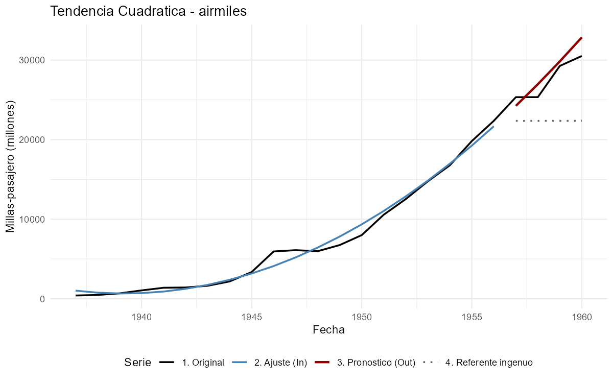{width=85%}

### Conclusión

Se ajustó por mínimos cuadrados la parábola $\hat T_t = `r num(ej$parametros$tabla["beta_0", "Estimacion"], 1)` `r num(ej$parametros$tabla["beta_1", "Estimacion"], 1)`\,t + `r num(ej$parametros$tabla["beta_2", "Estimacion"], 2)`\,t^2$, con los tres coeficientes significativos usando errores robustos y $R^2 = `r num(ej$parametros$R2, 4)`$. En validación ($h = `r ej$h`$) su MAD fue `r num(ej$medidas_out[["MAD"]], 1)` millones de millas-pasajero, frente a `r num(ej$medidas_referente_out[["MAD"]], 1)` del ingenuo, con MAPE de `r num(ej$medidas_out[["MAPE"]], 2)`%. Los residuos tienen media cero y no se rechaza su normalidad ($JB = `r num(e$jarque_bera$estadistico)`$, con solo `r e$n_errores` residuos), pero tienen autocorrelación según Ljung-Box ($Q = `r num(e$ljung_box$estadistico)`$) y Durbin-Watson ($d = `r num(e$durbin_watson$estadistico)`$).

### Recomendación

Este pronóstico sirve a una aerolínea o a una autoridad aeroportuaria de la época que planee compras de flota o ampliaciones para los años siguientes. Es razonable hasta los `r ej$h` años validados. Su límite es que una parábola crece sin freno: si la aceleración del tráfico se detiene, el pronóstico la sobreestimará cada vez más. Incluso dentro del horizonte validado, el mayor error absoluto fue de `r num(max(err_h(ej)), 1)` millones de millas-pasajero en un solo año, el `r num(err_rel_max(ej), 1)`% del valor observado ese año.

---

## 7. Tendencia Exponencial

```{r}
#| label: ej07-llamada
#| eval: false
ejecutar_protocolo("JohnsonJohnson", datasets::JohnsonJohnson,
                   "Shumway, R. H. and Stoffer, D. S. (2000) Time Series Analysis and its Applications. Second Edition. Springer. Example 1.1",
                   "Ganancia por accion (dolares)", "ajustar_tendencia", "Tendencia Exponencial",
                   p_params = 2, prefijo = "07", es_tendencia = TRUE, tipo_tend = "exponencial",
                   corregir_ses = TRUE, dL = 1.583, dU = 1.641)
```

### Descripción de la serie

```{r}
#| label: ej07-descripcion
ej <- resultados$ej07
c(N = ej$N, frecuencia = ej$frecuencia)
c(inicio = ej$fecha_ini, fin = ej$fecha_fin)
```

La serie `JohnsonJohnson` registra la ganancia trimestral por acción de la empresa Johnson & Johnson. Fuente: `r ej$fuente`. Unidad: `r tolower(ej$unidad)`. Frecuencia trimestral, de `r rango(ej)`, con $N = `r ej$N`$ observaciones.

### Patrón de la serie

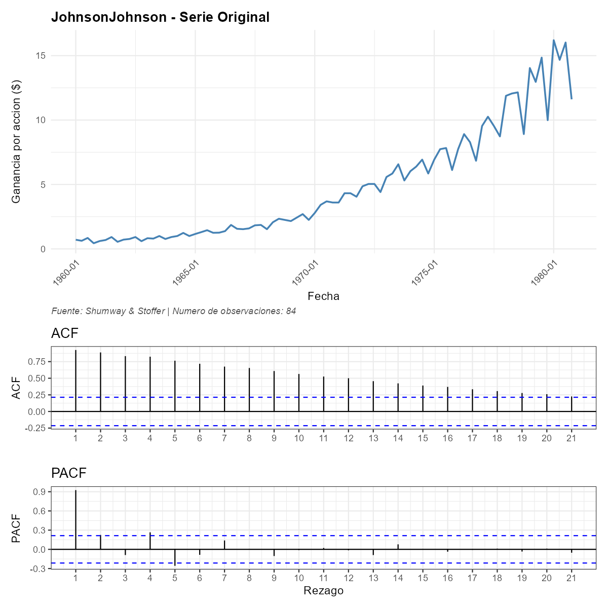{width=85%}

La ganancia crece a una tasa porcentual aproximadamente constante: la curva se empina con el tiempo y la amplitud de sus oscilaciones aumenta con el nivel. Ese es el supuesto de la tendencia exponencial $T_t = \beta_0\beta_1^t$, que al tomar logaritmos se vuelve lineal y estabiliza la varianza. La serie también tiene un patrón trimestral que se repite cada año; la tendencia exponencial no lo modela, y esa limitación se evalúa en la validación.

```{r}
#| label: ej07-rh-serie
#| echo: false
#| results: asis
prueba_rh(ej$acf_serie, ej$N, "la serie",
  "todas las autocorrelaciones examinadas son positivas, significativas y decaen lentamente, el correlograma típico de una serie dominada por una tendencia.",
  lags = c(1, 4, 8, 12, 16, 21))
prueba_lb(ej$lb_serie, ej$N, 0, "la serie",
  "la dependencia temporal es muy fuerte, producida por el crecimiento sostenido de la serie.")
```

### Partición y ajuste

La serie es estacional, así que el referente es el ingenuo estacional $\hat Y_{T+h} = Y_{T+h-4\lceil h/4 \rceil}$. El tramo de validación son las últimas $h = `r ej$h`$ observaciones, tres ciclos completos, y el ajuste usa las primeras `r ej$n_train`. La tendencia se estima sobre $\ln Y_t = a + \theta t + \varepsilon_t$ con las ecuaciones normales, y $\hat\beta_0 = e^{\hat a}$, $\hat\beta_1 = e^{\hat\theta}$. No requiere `optimizar()`.

```{r}
#| label: ej07-coeficientes
round(ej$parametros$tabla, 4)
c(beta0 = ej$parametros$beta0, beta1 = ej$parametros$beta1)
c(R2 = ej$parametros$R2, sigma2 = ej$parametros$sigma2, DW = ej$parametros$DW,
  rezagos_HAC = ej$parametros$rezagos_HAC)
```

El pronóstico $e^{\hat a + \hat\theta t}$ estima la mediana condicional de $Y_t$, no su media, porque la exponencial de la media de $\ln Y_t$ es menor que la media de $Y_t$. Por eso se aplicó la corrección de sesgo, que multiplica el pronóstico por $e^{\hat\sigma^2/2} = `r num(exp(ej$parametros$sigma2 / 2), 4)`$, un aumento de `r num(100 * (exp(ej$parametros$sigma2 / 2) - 1), 2)`%.

Los residuos de la regresión en logaritmos tienen autocorrelación positiva en los rezagos estacionales (se muestra más abajo), así que los errores estándar ordinarios subestiman la incertidumbre y las pruebas se hacen con los robustos. El error robusto de $\hat\theta$ es `r num(ej$parametros$tabla["theta", "SE_Robusto"] / ej$parametros$tabla["theta", "SE_OLS"], 2)` veces el ordinario.

```{r}
#| label: ej07-pruebas-coef
#| echo: false
#| results: asis
prueba_coef(ej, "a", "a",
  paste0("el intercepto en logaritmos es significativo; equivale a $\\hat\\beta_0 = e^{\\hat a} = ", num(ej$parametros$beta0), "$ dólares al inicio del tramo."))
prueba_coef(ej, "theta", "\\theta",
  paste0("la tasa de crecimiento es significativa: $\\hat\\beta_1 = e^{\\hat\\theta} = ", num(ej$parametros$beta1, 4), "$, es decir, la ganancia por acción crece en promedio un ", num(100 * (ej$parametros$beta1 - 1), 2), "% por trimestre."))
```

### Supuestos de la regresión sobre los residuos de $\ln Y_t$

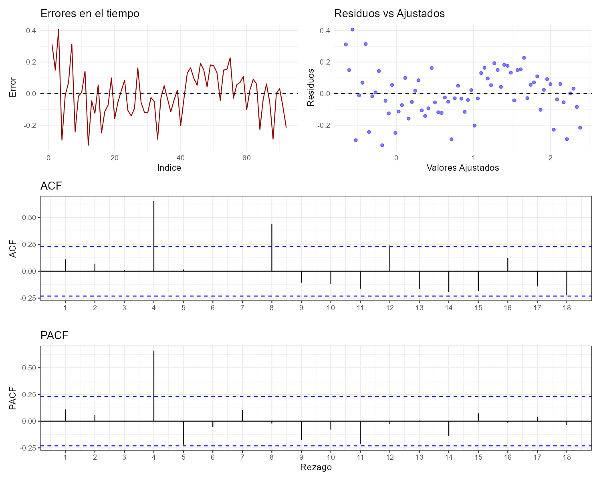{width=95%}

Como el modelo se ajusta en logaritmos, sus supuestos se revisan sobre los residuos de $\ln Y_t$. En el panel de residuos contra valores ajustados, los residuos se mantienen en una franja de ancho parecido a lo largo de todo el rango, con algo más de dispersión en los primeros valores: la escala logarítmica cumple su propósito de estabilizar la varianza, que en la escala original crecía con el nivel. En la ACF, los picos de los rezagos 4, 8 y 12 decrecen de forma regular, la huella de un patrón estacional que se repite cada año.

```{r}
#| label: ej07-regresion
#| echo: false
#| results: asis
g <- ej$errores_regresion
prueba_rh(g$acf, g$n_errores, "los residuos de la regresión en logaritmos",
  "los rezagos significativos son el 4, el 8 y el 12, múltiplos de la frecuencia trimestral: es la estacionalidad que la tendencia exponencial no modela.",
  lags = c(1, 4, 8, 12))
prueba_t(g$prueba_t_media, g$n_errores,
  "la media de los residuos es cero, lo cual está garantizado por construcción en una regresión con intercepto.")
prueba_lb(g$ljung_box, g$n_errores, 2, "los residuos de la regresión en logaritmos",
  "los residuos no son independientes, por la estacionalidad que queda en ellos.")
prueba_jb(g$jarque_bera,
  "los residuos en logaritmos son claramente compatibles con la normalidad, lo que respalda el modelo log-lineal.")
prueba_dw_tabla(g$durbin_watson, 1, 70,
  "no hay evidencia de autocorrelación de primer orden. Esto no contradice a Ljung-Box: Durbin-Watson solo examina el rezago 1, y la dependencia que queda está en los rezagos estacionales 4, 8 y 12. La tabla no tiene la fila $T = 72$ y se usa la inmediatamente inferior.")
```

### Medidas de precisión

```{r}
#| label: ej07-medidas
round(rbind(metodo_estimacion    = ej$medidas_in,
            metodo_validacion    = ej$medidas_out,
            referente_validacion = ej$medidas_referente_out), 4)
```

En validación, la tendencia exponencial obtiene un MAD de `r num(ej$medidas_out[["MAD"]])` dólares frente a `r num(ej$medidas_referente_out[["MAD"]])` del ingenuo estacional, un error `r num(100 * (1 - ej$medidas_out[["MAD"]] / ej$medidas_referente_out[["MAD"]]), 1)`% menor, con MAPE de `r num(ej$medidas_out[["MAPE"]], 2)`%. El MASE de `r num(ej$medidas_out[["MASE"]], 2)` es mayor que 1 porque se escala con el error del ingenuo estacional en el tramo de estimación, cuando la ganancia era mucho menor; en el tramo de validación la serie creció tanto que repetir el año anterior se queda corto.

### Validación de errores

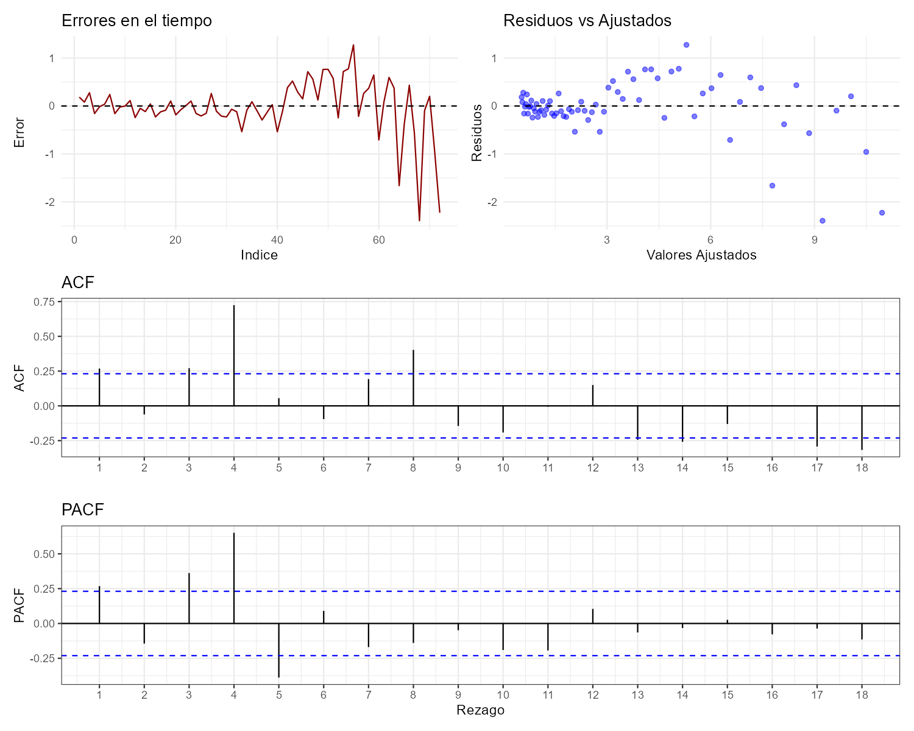{width=95%}

Los errores de un paso se evalúan en la escala original, en dólares por acción.

```{r}
#| label: ej07-errores
#| echo: false
#| results: asis
e <- ej$errores
prueba_rh(e$acf, e$n_errores, "los errores",
  "varios rezagos quedan fuera de la banda, entre ellos los estacionales 4 y 8: los errores repiten el patrón trimestral que el método no modela.",
  lags = c(1, 3, 4, 8, 13, 17))
prueba_t(e$prueba_t_media, e$n_errores,
  "los errores no están sesgados: la corrección de sesgo hace que el pronóstico no subestime la ganancia en promedio.")
prueba_lb(e$ljung_box, e$n_errores, 2, "los errores",
  "los errores no son independientes: queda la estructura estacional.")
prueba_jb(e$jarque_bera,
  "los errores en dólares no son normales: tienen colas muy pesadas, porque su tamaño crece con el nivel de la serie. Esta heterocedasticidad es la que el ajuste en logaritmos corrige.")
prueba_dw(e$durbin_watson,
  "hay autocorrelación positiva de primer orden en los errores en dólares.")
```

### Pronóstico

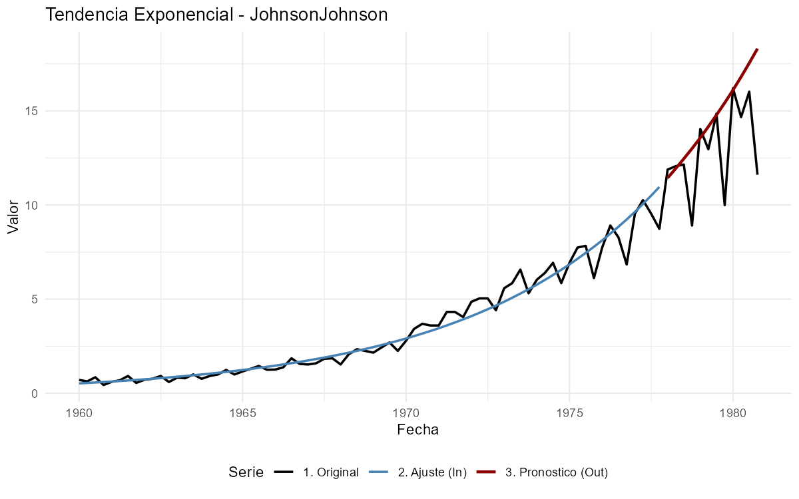{width=85%}

### Conclusión

Se ajustó la tendencia exponencial $\hat T_t = `r num(ej$parametros$beta0)` \times `r num(ej$parametros$beta1, 4)`^t$ sobre los logaritmos, con corrección de sesgo, ambos coeficientes significativos con errores robustos y $R^2 = `r num(ej$parametros$R2, 4)`$ en escala logarítmica. En validación ($h = `r ej$h`$) su MAD fue `r num(ej$medidas_out[["MAD"]])` dólares, frente a `r num(ej$medidas_referente_out[["MAD"]])` del ingenuo estacional, con MAPE de `r num(ej$medidas_out[["MAPE"]], 2)`%. Los residuos en logaritmos son normales ($JB = `r num(ej$errores_regresion$jarque_bera$estadistico)`$) pero conservan estacionalidad ($Q = `r num(ej$errores_regresion$ljung_box$estadistico, 2)`$); los errores en dólares tienen media cero ($t = `r num(e$prueba_t_media$estadistico)`$), pero no son independientes ($Q = `r num(e$ljung_box$estadistico, 2)`$) ni normales ($JB = `r num(e$jarque_bera$estadistico, 2)`$).

### Recomendación

Este pronóstico sirve a un inversionista interesado en la tendencia de largo plazo de las ganancias de la empresa, más que en el resultado de un trimestre particular. Es razonable hasta los `r ej$h` trimestres validados, tres años, para estimar el nivel general de la ganancia. Su límite es la estacionalidad: al ignorar el patrón trimestral, el pronóstico se ubica en medio de los picos y los valles de cada año, y en validación el mayor error absoluto fue de `r num(max(err_h(ej)), 2)` dólares en un solo trimestre, el `r num(err_rel_max(ej), 1)`% de la ganancia observada ese trimestre.

---

## 8. Holt Lineal

```{r}
#| label: ej08-llamada
#| eval: false
ejecutar_protocolo("LakeHuron", datasets::LakeHuron,
                   "Brockwell, P. J. and Davis, R. A. (1991). Time Series and Forecasting Methods. Second edition. Springer, New York. Series A, page 555",
                   "Nivel del lago (pies)", "ajustar_holt", "Holt Lineal",
                   p_params = 2, prefijo = "08",
                   param_rejilla = expand.grid(alpha = seq(0.05, 0.95, by = 0.05),
                                               beta  = seq(0.05, 0.95, by = 0.05)))
```

### Descripción de la serie

```{r}
#| label: ej08-descripcion
ej <- resultados$ej08
c(N = ej$N, frecuencia = ej$frecuencia)
c(inicio = ej$fecha_ini, fin = ej$fecha_fin)
```

La serie `LakeHuron` registra el nivel anual del lago Hurón. Fuente: `r ej$fuente`. Unidad: `r tolower(ej$unidad)`. Frecuencia anual, de `r rango(ej)`, con $N = `r ej$N`$ observaciones.

### Patrón de la serie

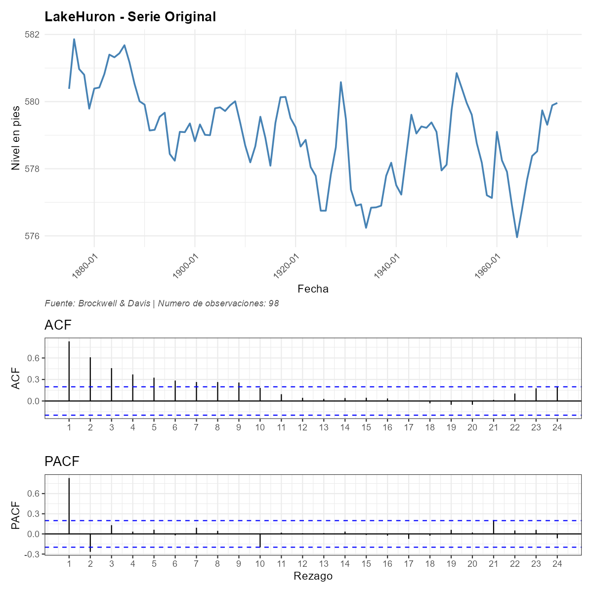{width=85%}

El nivel del lago desciende en el conjunto del período, pero no en línea recta: alterna tramos de bajada y de recuperación de varios años. Un nivel con una pendiente que cambia con el tiempo es el supuesto del método de Holt, que actualiza por separado el nivel y la pendiente.

```{r}
#| label: ej08-rh-serie
#| echo: false
#| results: asis
prueba_rh(ej$acf_serie, ej$N, "la serie",
  "las autocorrelaciones son positivas, significativas en los primeros nueve rezagos y decaen despacio: el nivel del lago es muy persistente y cambia de forma gradual, sin volver rápido a un valor fijo.",
  lags = c(1, 2, 3, 5, 9, 10))
prueba_lb(ej$lb_serie, ej$N, 0, "la serie",
  "la dependencia temporal es fuerte, así que el nivel y la dirección recientes del lago son informativos para pronosticar.")
```

### Partición y ajuste

El tramo de validación son las últimas $h = `r ej$h`$ observaciones y el ajuste usa las primeras `r ej$n_train`. Las constantes se eligieron con `optimizar()` sobre la rejilla del producto de $\{0.05, 0.10, \ldots, 0.95\}$ consigo mismo, es decir, 361 combinaciones de $(\alpha, \beta)$.

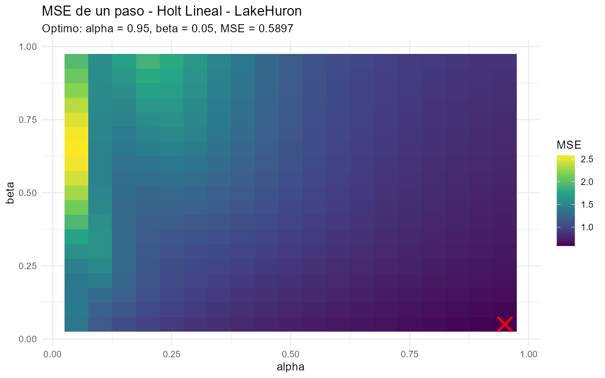{width=80%}

El óptimo es $\alpha = `r ej$optimizacion$optimo$alpha`$ y $\beta = `r ej$optimizacion$optimo$beta`$, con MSE de `r num(ej$optimizacion$optimo$mse, 4)`, y ambos caen en bordes de la rejilla. En el mapa, el MSE disminuye de forma continua hacia la esquina de $\alpha$ alto y $\beta$ bajo, y los valores más altos, cercanos a `r num(max(ej$optimizacion$rejilla$mse), 1)`, aparecen con $\alpha = 0.05$. Un $\alpha$ en el borde superior significa que el nivel se actualiza casi por completo con la última observación, de modo que el método se acerca al pronóstico ingenuo; eso indica que la serie no es estacionaria en media, porque no hay un nivel estable hacia el cual volver. Un $\beta$ en el borde inferior significa que la pendiente se actualiza muy poco: el método casi no incorpora tendencia. En conjunto, Holt se comporta aquí como un ingenuo con una pequeña deriva.

### Medidas de precisión

```{r}
#| label: ej08-medidas
round(rbind(metodo_estimacion    = ej$medidas_in,
            metodo_validacion    = ej$medidas_out,
            referente_validacion = ej$medidas_referente_out), 4)
```

En validación, Holt obtiene un MAD de `r num(ej$medidas_out[["MAD"]])` pies frente a `r num(ej$medidas_referente_out[["MAD"]])` del ingenuo, un error apenas `r num(100 * (1 - ej$medidas_out[["MAD"]] / ej$medidas_referente_out[["MAD"]]), 1)`% menor, con MAPE de `r num(ej$medidas_out[["MAPE"]], 2)`%. Que la diferencia sea tan pequeña es coherente con los parámetros en los bordes: el método es casi el ingenuo. El MASE de `r num(ej$medidas_out[["MASE"]], 2)` es mayor que 1 porque en validación se pronostica hasta `r ej$h` años adelante, mientras que el MASE se escala con el error de un año al siguiente.

### Validación de errores

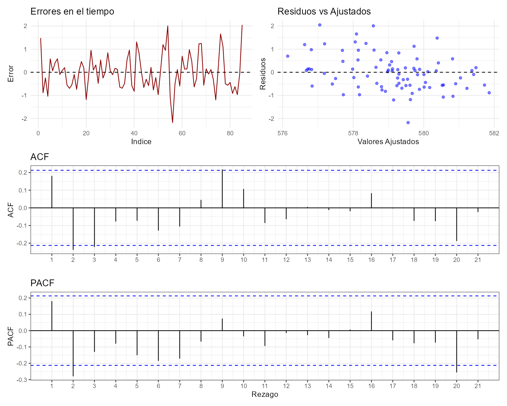{width=95%}

```{r}
#| label: ej08-errores
#| echo: false
#| results: asis
e <- ej$errores
prueba_rh(e$acf, e$n_errores, "los errores",
  "unos pocos rezagos quedan fuera de la banda, sin formar un patrón claro; el primer rezago está dentro de ella.",
  lags = c(1, 2, 3, 9))
prueba_t(e$prueba_t_media, e$n_errores,
  "los errores no están sesgados.")
prueba_lb(e$ljung_box, e$n_errores, 2, "los errores",
  "no se rechaza la independencia de los errores al 5%, aunque el valor p está cerca del límite.")
prueba_jb(e$jarque_bera,
  "los errores son compatibles con una distribución normal.")
prueba_dw(e$durbin_watson,
  paste0("la aproximación asintótica lleva a rechazar por poco. Sin embargo, la autocorrelación muestral del primer rezago, $r_1 = ", num(e$acf[1]), "$, queda dentro de la banda de $\\pm ", num(e$banda, 4), "$ y Ljung-Box no rechaza, así que la evidencia de autocorrelación de primer orden es marginal."))
```

### Pronóstico

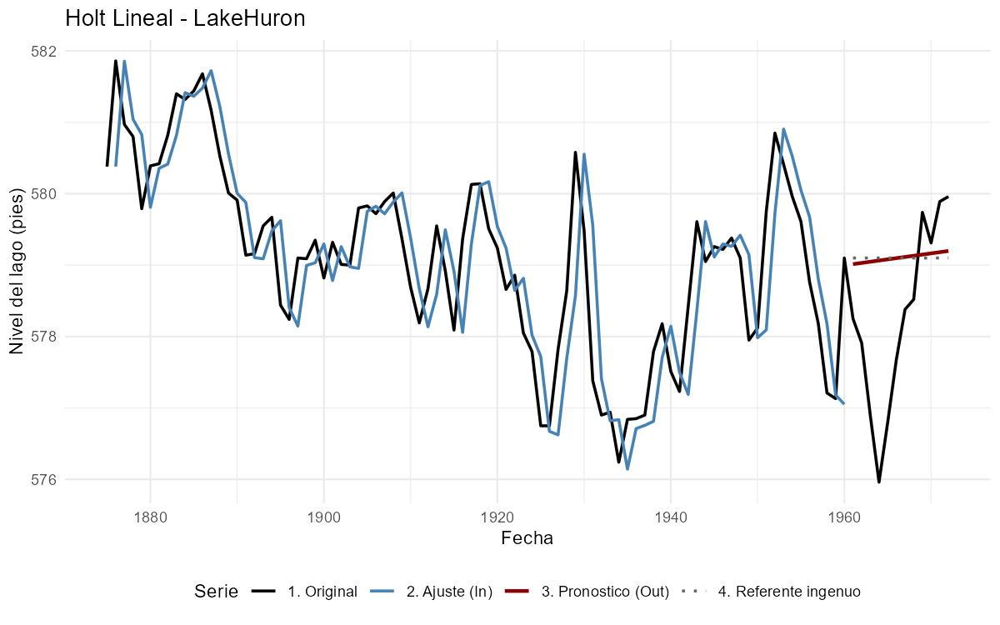{width=85%}

### Conclusión

Se ajustó el método de Holt con $\alpha = `r ej$optimizacion$optimo$alpha`$ y $\beta = `r ej$optimizacion$optimo$beta`$, elegidos por `optimizar()` en los bordes de la rejilla. En validación ($h = `r ej$h`$) su MAD fue `r num(ej$medidas_out[["MAD"]])` pies, frente a `r num(ej$medidas_referente_out[["MAD"]])` del ingenuo, con MAPE de `r num(ej$medidas_out[["MAPE"]], 2)`%. Los errores cumplen media cero ($t = `r num(e$prueba_t_media$estadistico)`$), independencia según Ljung-Box ($Q = `r num(e$ljung_box$estadistico, 2)`$, valor p `r vp(e$ljung_box$valor_p)`) y normalidad ($JB = `r num(e$jarque_bera$estadistico)`$), con una evidencia marginal de autocorrelación de primer orden según Durbin-Watson ($d = `r num(e$durbin_watson$estadistico)`$).

### Recomendación

Este pronóstico sirve a quienes administran la navegación y los puertos de los Grandes Lagos, que necesitan anticipar el nivel del agua de los años siguientes. Es razonable hasta los `r ej$h` años validados, pero su valor agregado sobre repetir el último nivel observado es muy pequeño. Su límite es que no anticipa los cambios de dirección del nivel del lago: en validación el mayor error absoluto fue de `r num(max(err_h(ej)), 2)` pies en un solo año, y la ganancia frente al ingenuo fue de apenas `r num(ej$medidas_referente_out[["MAD"]] - ej$medidas_out[["MAD"]], 3)` pies de MAD.

---

## 9. Contraejemplo: Media Simple sobre AirPassengers

```{r}
#| label: ej09-llamada
#| eval: false
ejecutar_protocolo("AirPassengers", datasets::AirPassengers,
                   "Box, G. E. P., Jenkins, G. M. and Reinsel, G. C. (1976) Time Series Analysis, Forecasting and Control. Third Edition. Holden-Day. Series G",
                   "Miles de pasajeros", "ajustar_media", "Media Simple (Contraejemplo)",
                   p_params = 0, prefijo = "09")
```

### Descripción de la serie

```{r}
#| label: ej09-descripcion
ej <- resultados$ej09
c(N = ej$N, frecuencia = ej$frecuencia)
c(inicio = ej$fecha_ini, fin = ej$fecha_fin)
```

La serie `AirPassengers` registra el total mensual de pasajeros de aerolíneas internacionales. Fuente: `r ej$fuente`. Unidad: `r tolower(ej$unidad)`. Frecuencia mensual, de `r rango(ej)`, con $N = `r ej$N`$ observaciones.

### Patrón de la serie

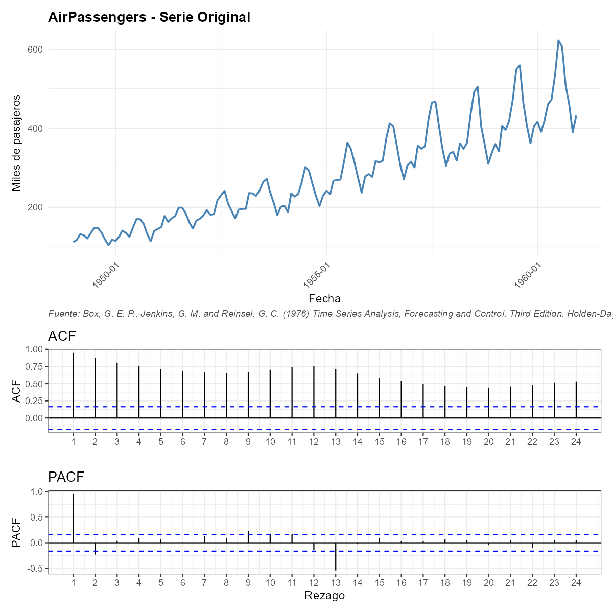{width=85%}

La serie tiene una tendencia creciente fuerte y una estacionalidad anual cuya amplitud aumenta con el nivel. Ambos rasgos contradicen el supuesto de la media simple, que es un nivel constante. Este ejemplo repite el método del ejemplo 1 sobre una serie inadecuada para mostrar en qué se nota que el método falla.

```{r}
#| label: ej09-rh-serie
#| echo: false
#| results: asis
prueba_rh(ej$acf_serie, ej$N, "la serie",
  "las 24 autocorrelaciones son significativas y decaen muy despacio, con repuntes en los rezagos 12 y 24: el correlograma combina una tendencia y una estacionalidad anual, exactamente lo contrario de un nivel constante.",
  lags = c(1, 6, 11, 12, 13, 24))
prueba_lb(ej$lb_serie, ej$N, 0, "la serie",
  "la dependencia temporal es extrema; la serie está muy lejos de ser un nivel constante con ruido.")
```

### Partición y ajuste

La serie es estacional, así que el referente es el ingenuo estacional. El tramo de validación son las últimas $h = `r ej$h`$ observaciones, un ciclo completo, y el ajuste usa las primeras `r ej$n_train`. El pronóstico de la media simple es $\bar Y_T = `r num(ej$parametros$estado_final, 2)`$ miles de pasajeros para todos los meses.

### Medidas de precisión

```{r}
#| label: ej09-medidas
round(rbind(metodo_estimacion    = ej$medidas_in,
            metodo_validacion    = ej$medidas_out,
            referente_validacion = ej$medidas_referente_out), 4)
```

En validación, la media simple obtiene un MAD de `r num(ej$medidas_out[["MAD"]], 2)` miles de pasajeros, `r num(ej$medidas_out[["MAD"]] / ej$medidas_referente_out[["MAD"]], 1)` veces el `r num(ej$medidas_referente_out[["MAD"]], 2)` del ingenuo estacional, con MAPE de `r num(ej$medidas_out[["MAPE"]], 2)`% y MASE de `r num(ej$medidas_out[["MASE"]], 2)`. El método no supera al referente, y la diferencia es enorme: el pronóstico se queda anclado en el promedio de todo el pasado, muy por debajo de los valores recientes.

### Validación de errores

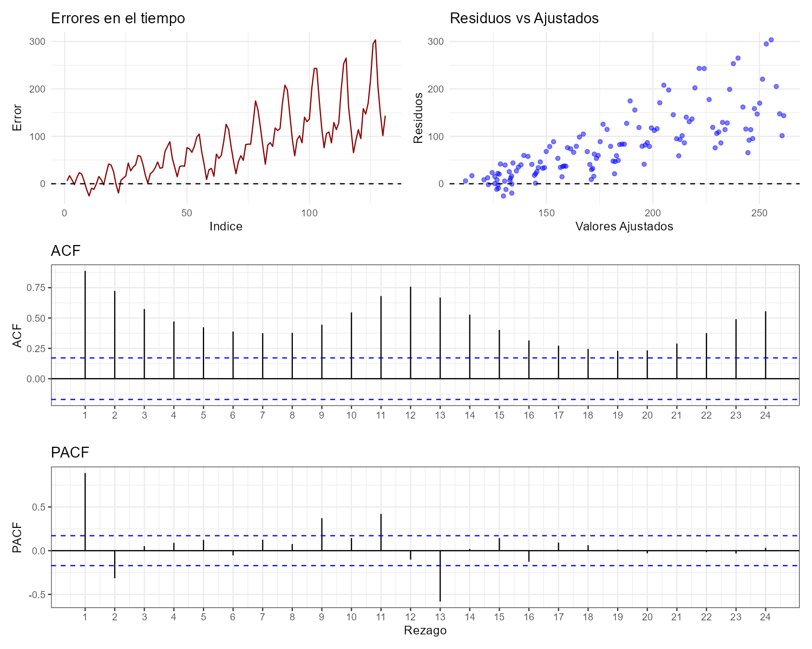{width=95%}

```{r}
#| label: ej09-errores
#| echo: false
#| results: asis
e <- ej$errores
prueba_rh(e$acf, e$n_errores, "los errores",
  "las 24 autocorrelaciones de los errores son significativas y decaen despacio, con repuntes en los rezagos 12 y 24: los errores heredan íntegras la tendencia y la estacionalidad de la serie. Esta es la huella más clara del fracaso del método en el correlograma.",
  lags = c(1, 6, 11, 12, 13, 24))
prueba_t(e$prueba_t_media, e$n_errores,
  "los errores están sesgados: son positivos en promedio, porque la media de todo el pasado va siempre por detrás de una serie que crece.")
prueba_lb(e$ljung_box, e$n_errores, 0, "los errores",
  "los errores están lejos de ser ruido blanco; el método no captura nada de la estructura de la serie.")
prueba_jb(e$jarque_bera,
  "los errores no son normales: tienen asimetría positiva, porque crecen a medida que la serie se aleja de su promedio histórico.")
prueba_dw(e$durbin_watson,
  paste0("hay autocorrelación positiva de primer orden casi total, con $r_1 \\approx ", num(e$durbin_watson$r1_aprox), "$."))
```

### Pronóstico

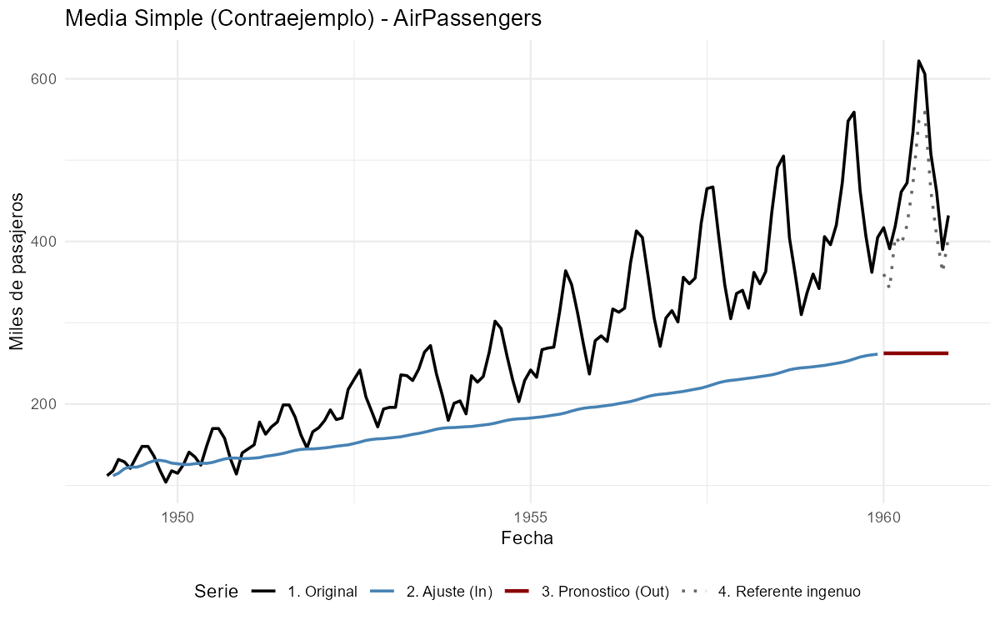{width=85%}

### Conclusión

Se aplicó la media simple a una serie con tendencia y estacionalidad, con pronóstico constante de `r num(ej$parametros$estado_final, 2)` miles de pasajeros. En validación ($h = `r ej$h`$) su MAD fue `r num(ej$medidas_out[["MAD"]], 2)`, frente a `r num(ej$medidas_referente_out[["MAD"]], 2)` del ingenuo estacional, con MASE de `r num(ej$medidas_out[["MASE"]], 2)`. La validación de errores falla en todas las pruebas: sesgo ($t = `r num(e$prueba_t_media$estadistico, 2)`$), autocorrelación según Ljung-Box ($Q = `r num(e$ljung_box$estadistico, 1)`$, valor p `r vp(e$ljung_box$valor_p)`) y Durbin-Watson ($d = `r num(e$durbin_watson$estadistico)`$), y no normalidad ($JB = `r num(e$jarque_bera$estadistico, 2)`$). El correlograma de los errores, con las 24 autocorrelaciones fuera de la banda y repuntes en los rezagos 12 y 24, muestra que la estructura de la serie pasó intacta a los errores.

### Recomendación

Este pronóstico no le sirve a nadie para planear: una aerolínea que lo usara subestimaría la demanda de cada mes del año siguiente. No hay un horizonte razonable, porque el error aparece desde el primer mes: en validación el error absoluto fue de `r num(err_h(ej)[1], 1)` miles de pasajeros en el primer mes y llegó a `r num(max(err_h(ej)), 1)` en el peor, frente a un pronóstico de `r num(ej$parametros$estado_final, 1)`. El límite del método es su supuesto de nivel constante: cuando la serie tiene tendencia y estacionalidad, la media simple no tiene cómo seguirlas.

---

## Resumen de los ejemplos

```{r}
#| label: resumen
#| echo: false
#| results: asis
param_txt <- function(ej) {
  if (is.null(ej$optimizacion)) return("Ninguno")
  op <- ej$optimizacion$optimo
  pars <- setdiff(names(op), "mse")
  paste(paste0(pars, " = ", sapply(pars, function(p) op[[p]])), collapse = ", ")
}
filas <- sapply(names(resultados), function(n) {
  ej <- resultados[[n]]
  supera <- if (ej$medidas_out[["MAD"]] < ej$medidas_referente_out[["MAD"]]) "Sí" else "No"
  paste0("| ", as.integer(sub("ej", "", n)), " | ", ej$metodo, " | `", ej$serie, "` | ", param_txt(ej), " | ",
         formatC(ej$medidas_out[["MAD"]], digits = 3, format = "f"), " | ",
         formatC(ej$medidas_referente_out[["MAD"]], digits = 3, format = "f"), " | ",
         formatC(ej$medidas_out[["MASE"]], digits = 3, format = "f"), " | ", supera, " |")
})
cat0("| Ejemplo | Método | Serie | Parámetros | MAD validación | MAD referente | MASE | ¿Supera al referente? |\n",
     "|---:|:---|:---|:---|---:|---:|---:|:---:|\n",
     paste(filas, collapse = "\n"), "\n\n")
```

Los ocho métodos superan a su referente en el tramo de validación, cada uno sobre una serie cuyo patrón corresponde a su supuesto, mientras que el contraejemplo lo pierde por un margen amplio. Las mayores ventajas aparecen donde la serie tiene tendencia (doble media móvil, tendencias lineal, cuadrática y exponencial), porque el ingenuo congela el último valor y no sigue el crecimiento. En Nile y LakeHuron la ventaja es pequeña: son series sin tendencia definida en las que el último valor ya es un buen pronóstico, y en el caso de Holt los parámetros óptimos en los bordes de la rejilla lo acercan al propio ingenuo.

---

## Bloques de verificación

Antes de usar las funciones propias en los ejemplos se verificó que reproducen los resultados de R y las identidades de las notas. La verificación usa una serie simulada de ruido blanco ($n = 100$, semilla 2026) y compara:

- la ACF muestral de `acf_muestral()` contra `acf(plot = FALSE)`, reportando la máxima diferencia absoluta, que debe ser menor que $10^{-12}$;
- el estadístico $Q_m$ de `ljung_box()` contra `Box.test(type = "Ljung-Box")`;
- el suavizamiento exponencial simple en su forma de corrección del error, $\hat Y_{t+1} = \hat Y_t + \alpha e_t$, contra su forma de promedio ponderado, $\hat Y_{t+1} = \sum_{j=0}^{t-2}\alpha(1-\alpha)^j Y_{t-j} + (1-\alpha)^{t-1}Y_1$;
- los coeficientes de las tres tendencias, estimados con las ecuaciones normales, contra `lm()`;
- las ecuaciones de Holt contra su forma de corrección del error, $L_t = L_{t-1} + \hat T_{t-1} + \alpha e_t$ y $\hat T_t = \hat T_{t-1} + \alpha\beta e_t$.

```{r}
#| label: verificacion
#| echo: false
#| comment: ""
inicio <- grep("BLOQUES DE VERIFICACION", salida_ejemplos)[1] - 1
cat(salida_ejemplos[inicio:length(salida_ejemplos)], sep = "\n")
```

Todas las comparaciones coinciden: las diferencias de la ACF y de Ljung-Box son del orden del error de redondeo de la máquina, y las demás identidades se cumplen exactamente. Esto respalda que las cifras de los ocho ejemplos provienen de implementaciones correctas.
